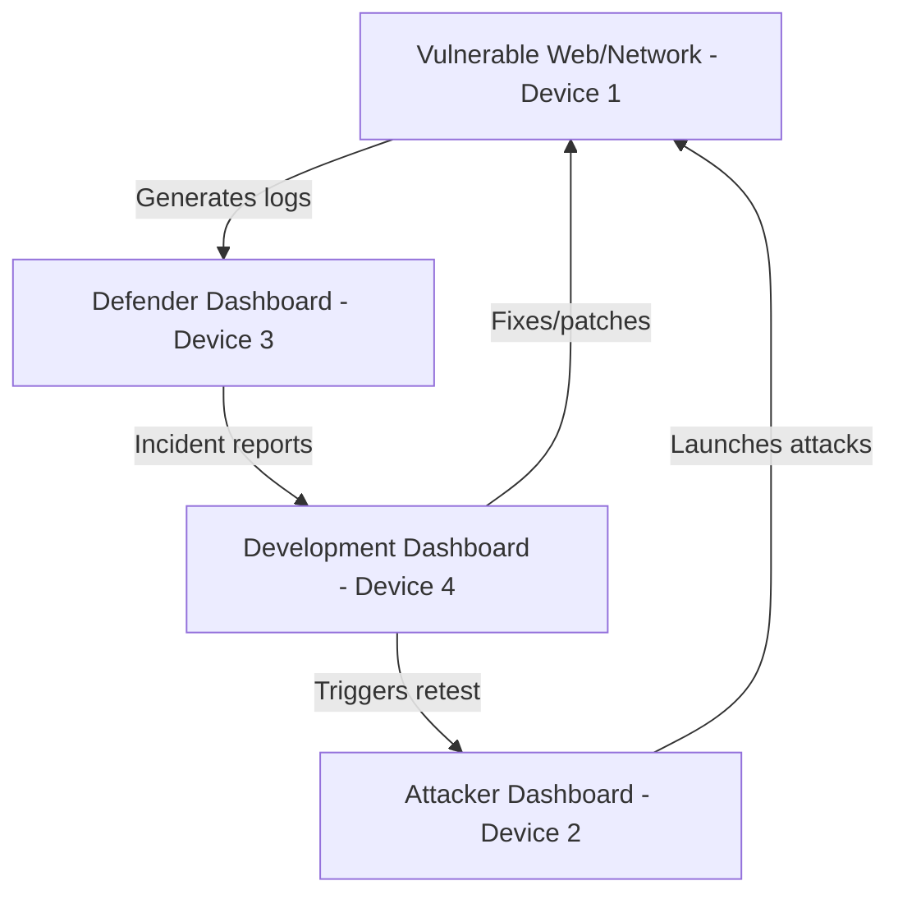
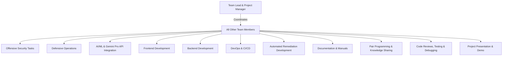
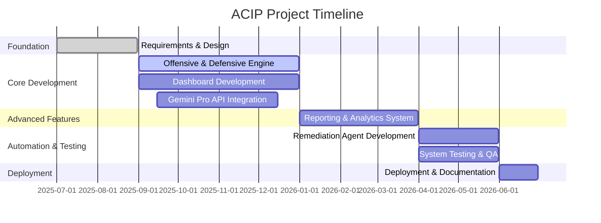

# Advanced Cybersecurity Intelligence Platform (ACIP):

**AI-Powered Attack, Defense, and Remediation in a Realistic Distributed Lab**

## Executive Summary

The **Advanced Cybersecurity Intelligence Platform (ACIP)** is a comprehensive, AI-driven cybersecurity solution designed for hands-on, multi-role learning and simulation. ACIP is deployed across four separate local devices, each representing a distinct role in the cybersecurity lifecycle: vulnerable target, attacker (red team), defender (blue team/SOC), and development (remediation). This distributed architecture mirrors real-world organizational environments, enabling deep practical experience in offensive security, defensive monitoring, and secure development, all enhanced by AI (Gemini Pro API) integration.

## Project Goals

- **Simulate real-world cyber operations** by separating attack, defense, and remediation roles across different machines.
- **Foster cross-disciplinary learning** by rotating team members through all roles and technologies.
- **Leverage AI** to automate analysis, reporting, and remediation suggestions.
- **Demonstrate the full cyber incident lifecycle** from attack to detection, reporting, and fix validation.

## System Architecture

### Physical Deployment

| Device | Hosted Component | Main Functionality |
| :-- | :-- | :-- |
| 1 | Vulnerable Web/Network | Target for attacks; simulates real-world vulnerable applications/services |
| 2 | Attacker Dashboard | Launches attacks, receives triggers from dev team |
| 3 | Defender Dashboard | Monitors logs, detects/responds to attacks, generates incident reports |
| 4 | Development Dashboard | Receives reports, fixes code/config, triggers retesting, deploys patches |

### Architecture Diagram

## Platform Modules \& Features

### 1. Offensive Security (Attacker Dashboard, Device 2)

- Launches penetration tests and exploits against Device 1.
- Supports web, network, API, and mobile attack modules.
- Integrates Gemini Pro API for attack suggestions and automated exploit generation.
- Receives triggers/notes from the development team for retesting.

### 2. Defensive Operations (Defender Dashboard, Device 3)

- Collects and analyzes logs from Device 1 in real time.
- Detects attacks, correlates events, and raises alerts.
- Uses Gemini Pro API for threat analysis and incident prioritization.
- Generates and forwards incident reports to the development dashboard.

### 3. Remediation \& Development (Development Dashboard, Device 4)

- Receives incident reports and vulnerability details.
- Uses Gemini Pro API to suggest code/config fixes.
- Deploys patches or configuration changes to Device 1.
- Sends triggers/notes to the attacker dashboard to initiate retesting.

### 4. Vulnerable Target (Device 1)

- Hosts intentionally vulnerable web applications or network services.
- Acts as the live target for attack and defense exercises.
- Receives patches and updates from the development dashboard.

## Team Structure and Roles

- **Team Lead \& Project Manager:** Coordination, timeline, quality assurance

**All other team members will:**

- Participate in offensive security tasks (attacks, scanning, simulation)
- Engage in defensive operations (monitoring, detection, incident response)
- Collaborate on AI/ML integration (Gemini Pro API, automation)
- Contribute to frontend (dashboard UI) and backend (APIs, microservices) development
- Take part in DevOps (CI/CD, deployment, infrastructure)
- Develop/test automated remediation scripts and agents
- Rotate through documentation tasks (technical, user, process)
- Pair up for knowledge sharing and mentoring
- Participate in code reviews, testing, and debugging
- Present and demonstrate features during meetings and the final presentation

### Team Collaboration Diagram

## Technical Stack

- **Backend:** Python, FastAPI/Django, RESTful APIs, PostgreSQL/MongoDB
- **Frontend:** React.js, TypeScript, Material-UI
- **AI/ML:** Gemini Pro API, scikit-learn/TensorFlow for custom models
- **Security:** OAuth2/JWT, RBAC, TLS/SSL
- **DevOps:** Docker, CI/CD pipelines, local network configuration

## Algorithms \& Computer Science Concepts

- **Vulnerability Scanning:** Pattern matching, graph traversal
- **Anomaly Detection:** ML clustering/classification
- **Incident Correlation:** Event graph analysis
- **Remediation Automation:** Static code analysis, AI code generation
- **Secure Coding:** Encryption, hashing, network protocol security

## Project Timeline

## Documentation

- **Deployment Guide:** Step-by-step for setting up each device and dashboard
- **Network Topology:** Diagrams and configuration
- **Technical Docs:** Architecture, APIs, data flows
- **User Manuals:** For each dashboard and workflow
- **Security Docs:** Access controls, incident response, remediation processes

## Innovative Features

- **Distributed, Realistic Lab:** Each role on a separate device, simulating real-world operations
- **AI-Driven Collaboration:** Gemini Pro API for analysis, reporting, and remediation
- **Full Lifecycle Coverage:** Attack, detection, reporting, remediation, and retesting
- **Cross-Disciplinary Learning:** All team members rotate through all roles and technologies

## Conclusion

This ACIP deployment provides a realistic, hands-on environment for learning and demonstrating advanced cybersecurity practices. By separating each role onto its own device and integrating AI, your team will gain valuable experience in offensive, defensive, and development operations, as well as in cross-team communication and secure system design. This project is a powerful showcase of both technical and collaborative skills, preparing your team for real-world cybersecurity challenges.

