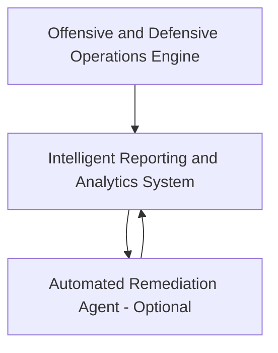
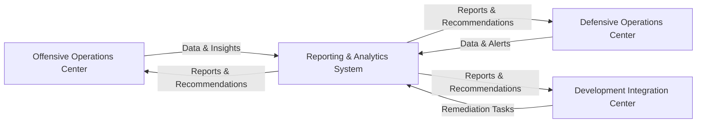
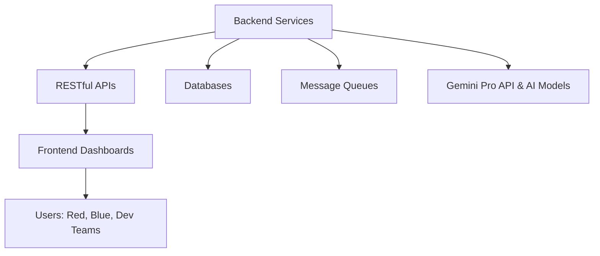
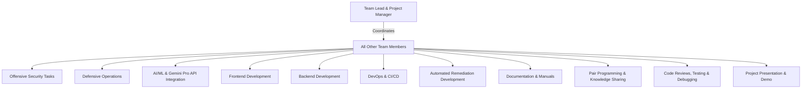
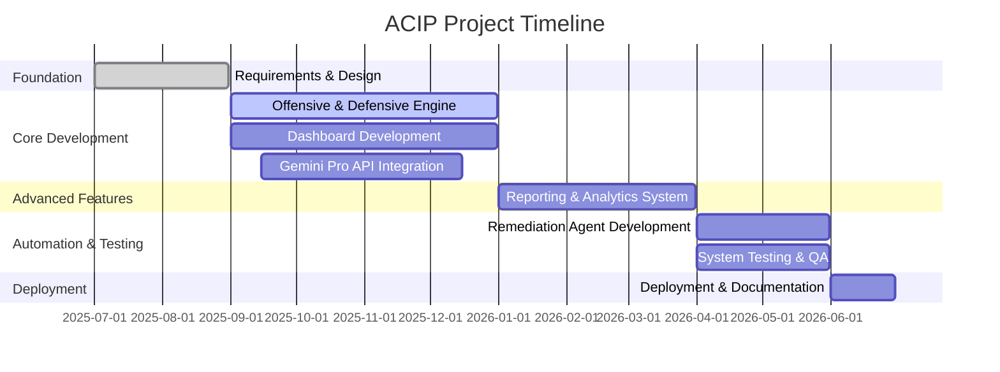

# Advanced Cybersecurity Intelligence Platform (ACIP): AI-Powered Unified Red Team, Blue Team, and Remediation Ecosystem

## Executive Summary

The **Advanced Cybersecurity Intelligence Platform (ACIP)** is a comprehensive, AI-driven cybersecurity solution that unifies offensive operations, defensive operations, and automated remediation. Leveraging the Gemini Pro API, ACIP enhances collaboration between red teams, blue teams, and development teams through intelligent dashboards, automated reporting, and AI-powered vulnerability remediation.

## Project Overview

### Core Architecture

ACIP is designed with a modular microservices architecture for scalability, maintainability, and seamless integration. The platform consists of three primary modules:

- **Offensive and Defensive Operations Engine**: Automated penetration testing, vulnerability scanning, SOC monitoring, incident response, and threat intelligence integration.
- **Intelligent Reporting and Analytics System**: AI-powered report generation, risk assessment, and executive dashboards.
- **Automated Remediation Agent (Optional)**: AI-driven code patching, network security automation, and continuous validation.

## Creative Project Names

- Synergetic Cyber Defense Intelligence Platform
- Adaptive Threat Response Ecosystem
- Intelligent Security Operations Nexus
- Unified Cyber Resilience Platform

## Three-Dashboard Architecture

### Dashboard 1: Offensive Operations Center

- **Users**: Red Team Engineers, Penetration Testers
- **Features**: Attack simulation, vulnerability scanning, AI-powered attack suggestions, exploit toolkit, progress tracking

### Dashboard 2: Defensive Operations Center

- **Users**: Blue Team Engineers, SOC Analysts
- **Features**: Threat monitoring, incident response automation, threat intelligence, anomaly detection, log analysis

### Dashboard 3: Development Integration Center

- **Users**: Development Teams, DevOps Engineers
- **Features**: Vulnerability tracking, code security analysis, CI/CD security, automated patch deployment, secure SDLC management

## Technical Architecture and Components

- **Backend**: Python, Go, Java (FastAPI, Django, Spring Boot)
- **Frontend**: React.js, TypeScript, Redux, Material-UI
- **AI/ML**: Gemini Pro API, TensorFlow, PyTorch
- **Security**: OAuth 2.0, JWT, AES-256, TLS/SSL

## Computer Science Knowledge Integration

- **Algorithms**: Anomaly detection, classification, clustering, graph algorithms, cryptography, hashing, pattern matching
- **Data Processing**: Stream/batch processing, graph databases
- **Network Programming**: TCP/IP, HTTP/HTTPS, process and memory management, file system security

## Team Structure and Roles

- **Team Lead \& Project Manager**: Coordination, timeline, quality assurance

**All other team members will:**

- Participate in offensive security tasks such as vulnerability scanning, penetration testing, and attack simulation.
- Engage in defensive operations including SOC monitoring, incident detection, and incident response workflows.
- Collaborate on integrating AI/ML models and the Gemini Pro API for intelligent analysis and automation.
- Contribute to frontend development using React.js and modern UI frameworks to build interactive dashboards.
- Work on backend development with RESTful APIs, microservices, and database management.
- Take part in DevOps activities like CI/CD pipeline setup, deployment automation, and infrastructure management.
- Develop and test automated remediation scripts and agents for code and network fixes.
- Rotate through documentation tasks, including technical documentation, user manuals, and process guides.
- Pair up with other team members to share knowledge and mentor each other in unfamiliar technologies.
- Participate in regular code reviews, testing, and debugging sessions to ensure software quality.
- Present and demonstrate project features during team meetings and the final project presentation.

## Team Collaboration and Experience Flow (Mermaid Diagram)

This diagram illustrates how the team lead coordinates all members, and how every member participates in each domain of the project, ensuring broad experience and collaborative growth.

## Implementation Timeline

## Documentation Requirements

- **Technical Documentation**: System architecture, SRS, API documentation
- **User Documentation**: User manuals, guides, security documentation
- **Process Documentation**: Project management docs, deployment and operations guide

## Innovative Features and Competitive Advantages

- **AI-Powered Threat Intelligence**: Predictive analytics, contextual analysis, automated correlation
- **Unified Collaboration Platform**: Cross-team communication, real-time collaboration, knowledge sharing
- **Automated Remediation Capabilities**: Code-level fixes, infrastructure automation, continuous validation

## Scalability and Future Enhancements

- **Modular Architecture**: Easy feature addition, technology upgrades, performance scaling
- **Extensibility**: Plugin architecture, custom workflows, multi-tenant support
- **Enhancement Roadmap**: Advanced AI, IoT/cloud/mobile security, custom model integration

# Mapping ACIP Project Proposal to Graduation Project Steps

## 1. Choosing the Topic

- **Real-World Problem:** Modern organizations struggle to unify offensive (red team), defensive (blue team), and remediation efforts, often lacking AI-driven integration and collaboration.
    
- **Interests & Skills:** The project leverages cybersecurity, AI, software engineering, and teamwork—matching your team's computer science background.
    
- **Feasibility & Resources:** The modular design, use of Gemini Pro API, and division of roles ensure the project is achievable with available skills and tools.
    

## 2. Defining Objectives

- **Main Goal:** Develop an AI-powered platform that unifies red team, blue team, and development operations for proactive cybersecurity.
    
- **Measurable Outcomes:**
    
    - Automated offensive and defensive modules
        
    - AI-generated security reports
        
    - Automated remediation agent (optional)
        
    - Three interactive dashboards for different user roles
        
- **Scope & Boundaries:**
    
    - Initial focus on web applications, extendable to networks, APIs, and mobile apps
        
    - Core modules are mandatory; remediation agent is an advanced, optional feature
        

## 3. Literature Review

- **Existing Solutions:** Research covers current cybersecurity platforms, AI integration in security, and collaborative dashboards.
    
- **Gaps Identified:** Most solutions lack seamless AI-powered collaboration and automated remediation across all teams.
    
- **Best Practices:** Incorporates modular architecture, agile development, and industry-standard security protocols.
    

## 4. Project Planning

- **Timeline:** Detailed Gantt chart in the proposal outlines phases from requirements to deployment.
    
- **Task Assignment:** Roles are clearly divided among six team members (lead, red team, blue team, AI/ML, full-stack/devops, automation).
    
- **Methodologies & Tools:** Agile/Scrum, microservices, RESTful APIs, React.js, Gemini Pro API, and secure coding practices.
    

## 5. System Design & Development

- **Architecture:** Modular microservices with clear data flow, as visualized in Mermaid diagrams.
    
- **Development Stages:**
    
    - Offensive and defensive modules
        
    - Reporting and analytics system
        
    - Remediation agent (optional)
        
    - Dashboard interfaces
        
- **Testing & Debugging:** Ongoing throughout each phase, with dedicated system testing and QA before deployment.
    

## 6. Documentation

- **Technical:** System architecture, SRS, API docs, database schema.
    
- **User:** Manuals for each dashboard, configuration guides, security documentation.
    
- **Process:** Project management docs, deployment guides, risk management, and quality assurance procedures.
    

## 7. Presentation & Evaluation

- **Final Presentation:** Demonstrate the platform’s dashboards, AI integrations, and automated workflows.
    
- **Demonstration:** Live scenarios showing offensive, defensive, and remediation operations with real-time reporting.
    
- **Evaluation Prep:** Prepare to answer questions on design choices, implementation, algorithms, and future enhancements.
    
## Conclusion

The ACIP project demonstrates advanced integration of AI, cybersecurity, and software engineering principles. Its modular, scalable design and collaborative dashboards empower teams to proactively defend, analyze, and remediate threats, positioning your team at the forefront of modern cybersecurity innovation.

⁂

