# Advanced Cybersecurity Intelligence Platform (ACIP)

Bold takeaway: Build a five-device, localhost-simulated cybersecurity service platform that proves commercial viability for MENA-focused MSSPs by unifying red/blue/dev/client workflows, embedding Human-AI Teaming in each dashboard, and delivering a tightly scoped, feasible MVP for a six-student team.

## Executive Summary

ACIP is a commercial-grade MVP designed to solve operational inefficiency and client communication gaps facing small-to-medium MSSPs in the MENA region. The project implements a five-device, containerized, local network: a Vulnerable Target, Red Team dashboard, SOC dashboard, Development (remediation) dashboard, and Client portal. Each dashboard includes an embedded AI Agent to assist the human operator, demonstrating Human-AI Teaming that accelerates triage, improves remediation quality, and elevates client transparency. The MVP validates market need, de-risks product assumptions, and provides full-stack, end-to-end academic value.

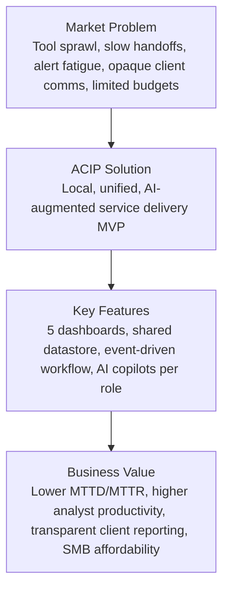

## Problem Statement \& Economic Viability

MENA MSSPs face unsustainable operations driven by alert fatigue, siloed tools, manual context switching, and weak client communication. SMEs require affordable, outcome-driven security services with transparent reporting and fast remediation. ACIP replaces fragmented workflows with a unified, localhost platform that shortens MTTD/MTTR, aligns teams around shared artifacts, and provides client-ready narratives via AI. Commercialization pathways include tiered B2B SaaS, offline/on-prem options, and AI usage add-ons.

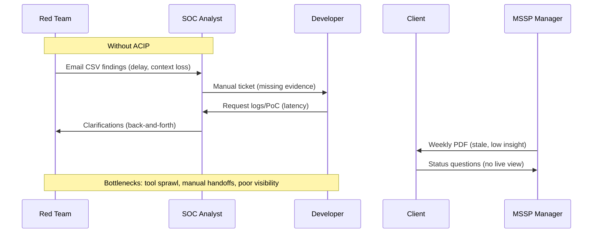

## Project Goals

The goals are split into product outcomes (MVP) and academic outcomes to ensure feasibility, learning depth, and a credible market narrative.

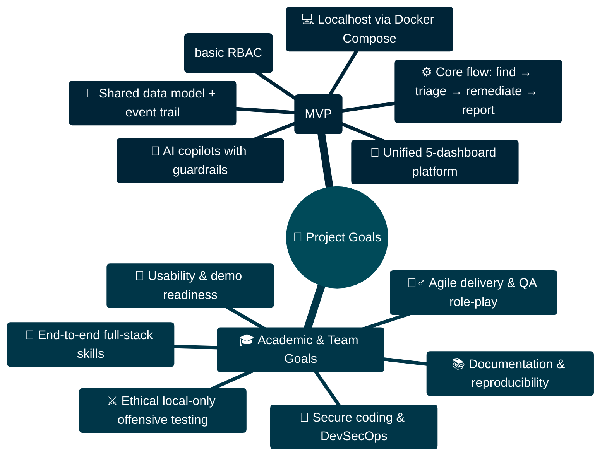

## Scope \& MVP Feature Definition

Feasibility is enforced by a narrow, end-to-end slice that demonstrates commercial value without overextending the team.

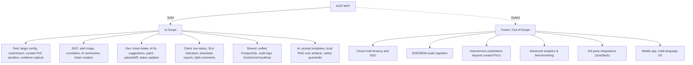

## System Architecture

Design: containerized five-device local network with a unified datastore and a lightweight event mechanism. AI Agents run with scoped context via local RAG and audited prompts.

Roles:

- Vulnerable Target: intentionally vulnerable app with logs, supports deterministic scenarios.
- Red Team Dashboard: controlled scans/imports, PoC sandbox, evidence to shared store.
- SOC Dashboard: alert detection/triage, correlation, ticket promotion to Dev.
- Dev Dashboard: remediation planning, patch submission, status sync to Client.
- Client Portal: real-time visibility, risk summaries, report generation.

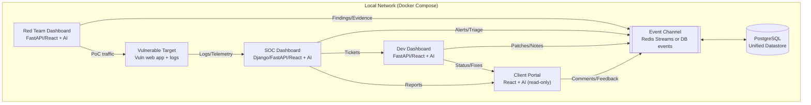

## Team Structure \& Execution Plan

A collective full-stack model ensures all six students contribute across services. The Team Lead/PM facilitates sprints while coding as an IC. QA uses role-playing to validate handoffs and usability.

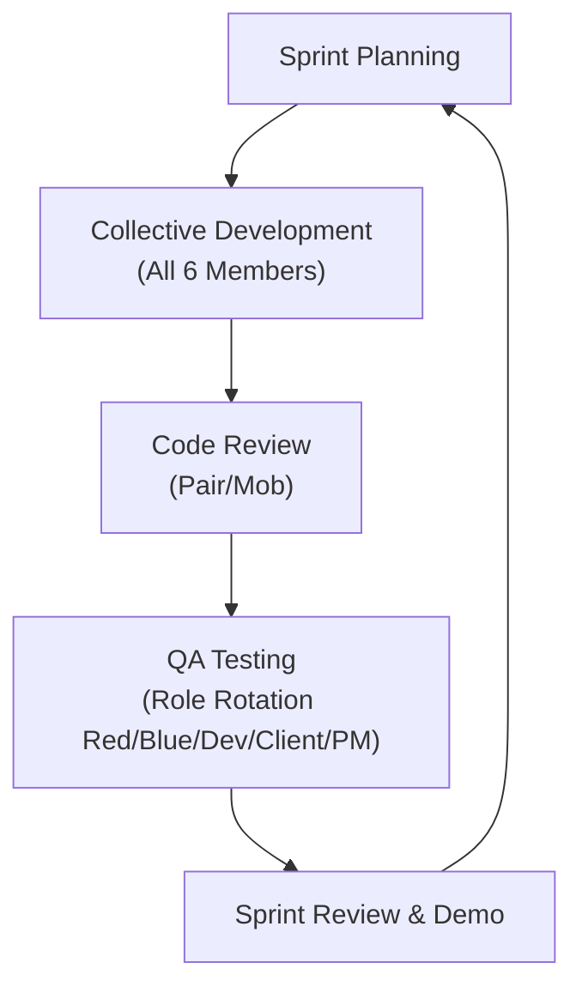

## Technical Stack

Choices emphasize developer familiarity, local reproducibility, and AI enablement.

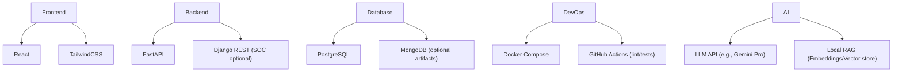

## Project Timeline (Gantt Chart)

Eight months across five phases, with buffer for integration, QA, and documentation. Dates reflect an academic calendar and enable predictable milestones.

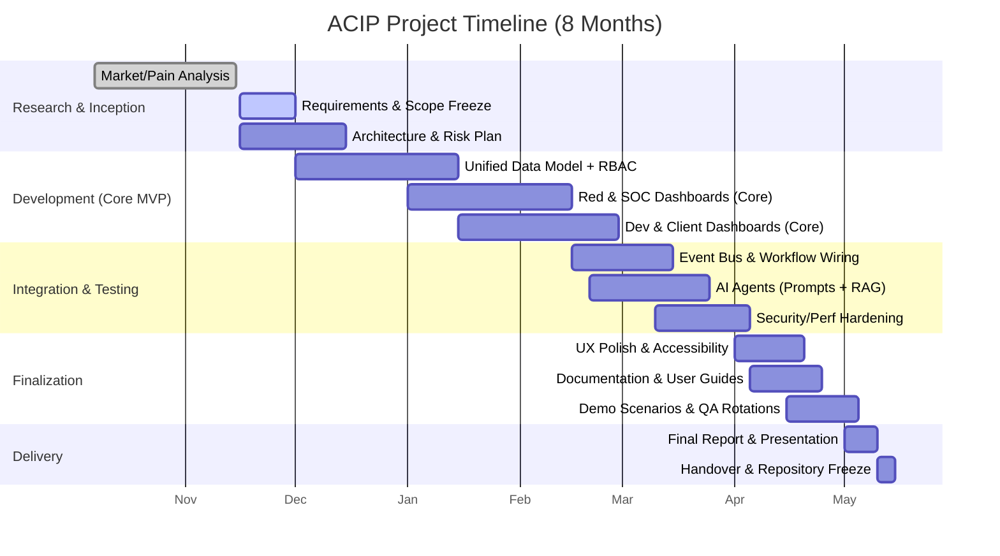

## Scope \& MVP Feature Breakdown (Five Dashboards)

Crisp, testable capabilities for each dashboard ensure a demonstrable end-to-end value chain.

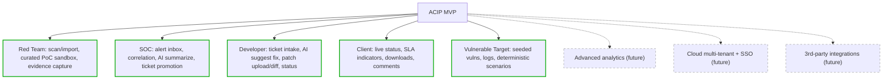

## AI Agents: Human-AI Teaming Design

Each dashboard includes a task-scoped AI copilot with strict guardrails, local-context retrieval, and full auditability. Start with “read-only” summaries; progress to guided actions as confidence grows.

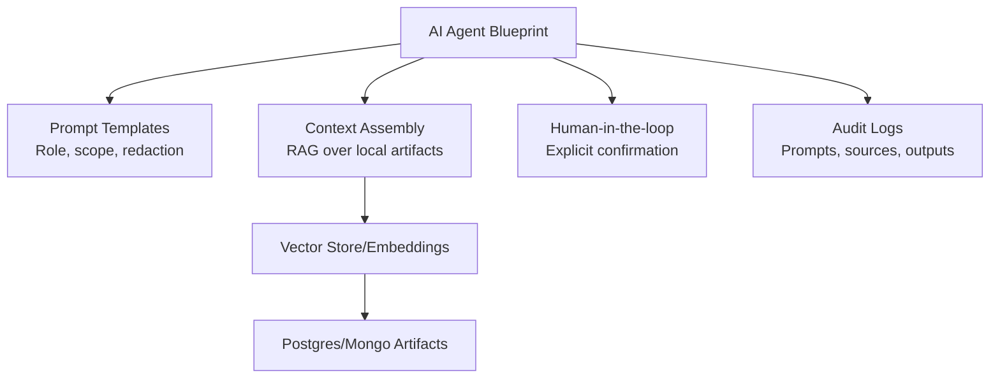

## Security, Compliance, and Ethics (Localhost)

All offensive actions are constrained to a sandboxed, local environment. Evidence destined for clients is sanitized by default. AI outputs cite local sources and undergo redaction checks.

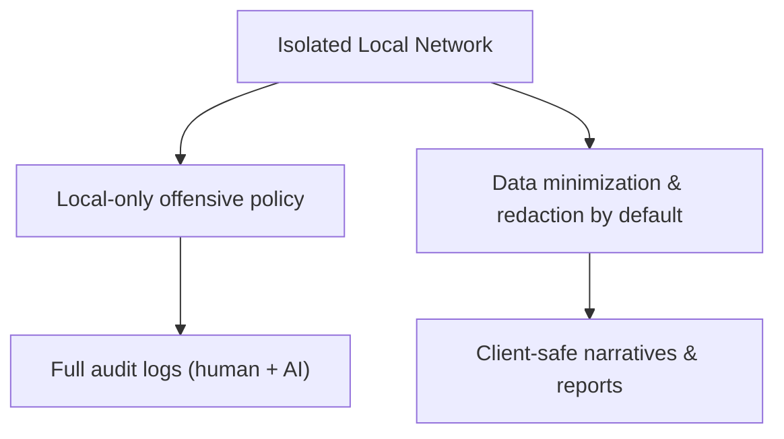

## Testing \& QA Methodology

Evidence-driven testing ensures reliability and pedagogy: unit tests, integration tests across services, and role-play end-to-end scenarios with rubrics.

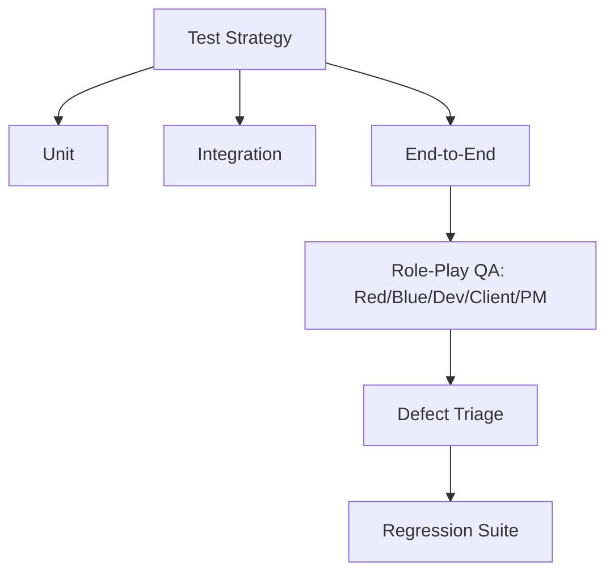

## Risk Management \& Feasibility Controls

Risks are managed with progressive enhancement and well-defined fallbacks.

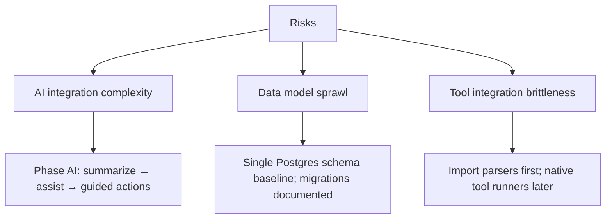

## Development \& Demo Scenarios

Deterministic scenarios validate product value and support grading.

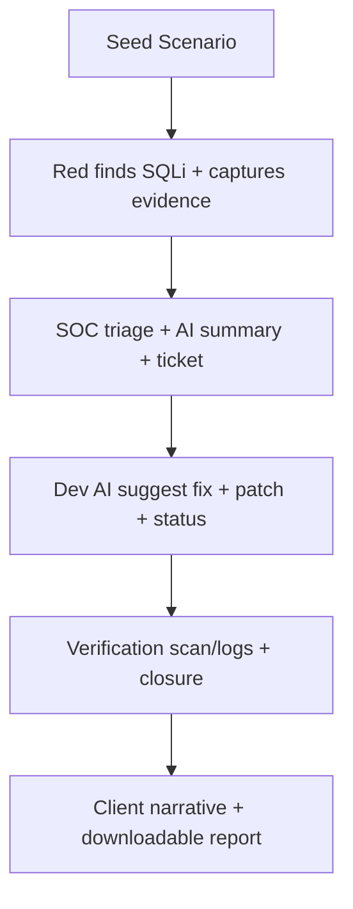

## Deployment \& Operations (Localhost)

A single “docker compose up” orchestrates services. Seed scripts provide demo users, data, and scenarios. Minimal CI runs lint/tests per push.

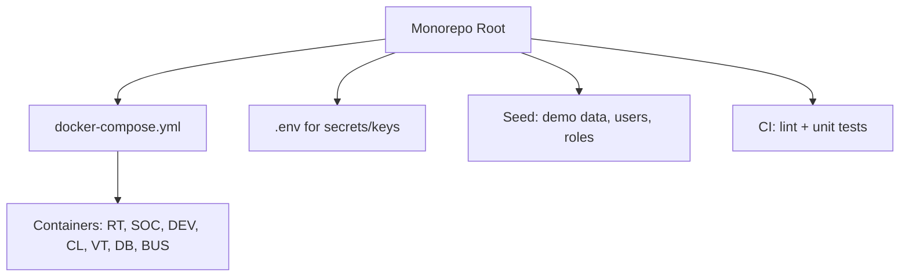

## Final Deliverables

Expected outputs align with academic rigor and commercial storytelling: a working MVP, source code, technical documentation, user manuals per dashboard, and a final presentation.

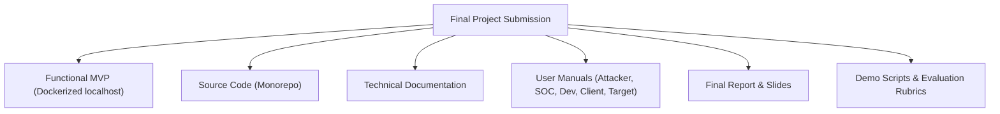

***

## Appendix A: Minimal Data Model (MVP)

Entities: Asset, Finding, Evidence, Alert, Ticket, Patch, Report, User, Role, Comment. Flow: Finding → Alert → Ticket → Patch → Report, with evidence linked at finding/ticket stages. Use a single Postgres schema for simplicity; optional artifacts bucket if needed.

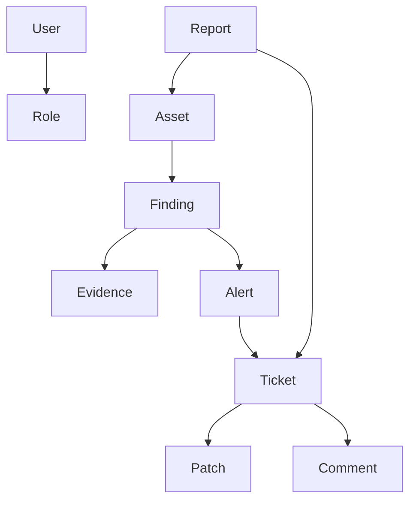

## Appendix B: Acceptance Criteria (Selected)

- Red→SOC: Finding with evidence visible in SOC triage within 5 seconds, metadata intact.
- SOC→Dev: Ticket includes asset, severity, PoC summary, reproduction steps, and evidence link.
- Dev→Client: Status updates propagate to Client within 5 seconds; downloadable report available.
- AI: Outputs include source pointers to local artifacts and pass redaction checks before display.

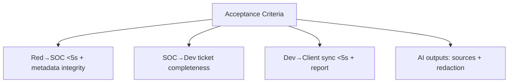

## Appendix C: Implementation Blueprint (Sprint-Ready Tasks)

- Data model: implement tables, migrations, seed scripts.
- Red: scan result import parser (e.g., Nuclei JSON), PoC request module, evidence storage.
- SOC: log watcher, signature-based detector, alert inbox UI, AI summarize endpoint.
- Dev: ticket queue, diff viewer, AI suggest fix endpoint, patch status flow.
- Client: status dashboard, SLA timers, report generator (AI-assisted), comments thread.
- AI: prompt templates per role, RAG over local artifacts, audit logging middleware.

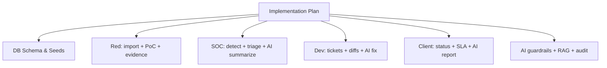

## Appendix D: Business Model Options (Post-MVP)

- Tiered B2B SaaS: priced by client count, analyst seats, or data volume; AI usage bundles.
- On-prem appliance: regulated/offline customers; maintenance subscription.
- Add-ons: analytics pack, integrations marketplace, compliance templates.
- Land-and-expand: starter tier for SMEs; upsell to reporting/analytics and integrations.

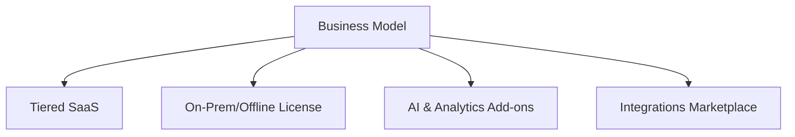

***
