# Advanced Cybersecurity Intelligence Platform (ACIP)

**Bold takeaway:** Build a five-device, localhost-simulated cybersecurity service platform that proves commercial viability for MENA-focused MSSPs by unifying red/blue/dev/client workflows, embedding Human-AI Teaming in each dashboard, and delivering a tightly scoped, feasible MVP for a six-student team.

## Executive Summary

ACIP is a commercial-grade MVP designed to solve operational inefficiency and client communication gaps facing small-to-medium MSSPs in the MENA region. The project implements a five-device, containerized, local network: a Vulnerable Target, Red Team dashboard, SOC dashboard, Development (remediation) dashboard, and Client portal. Each dashboard includes an embedded AI Agent to assist the human operator, demonstrating Human-AI Teaming that accelerates triage, improves remediation quality, and elevates client transparency. The MVP validates market need, de-risks product assumptions, and provides full-stack, end-to-end academic value.

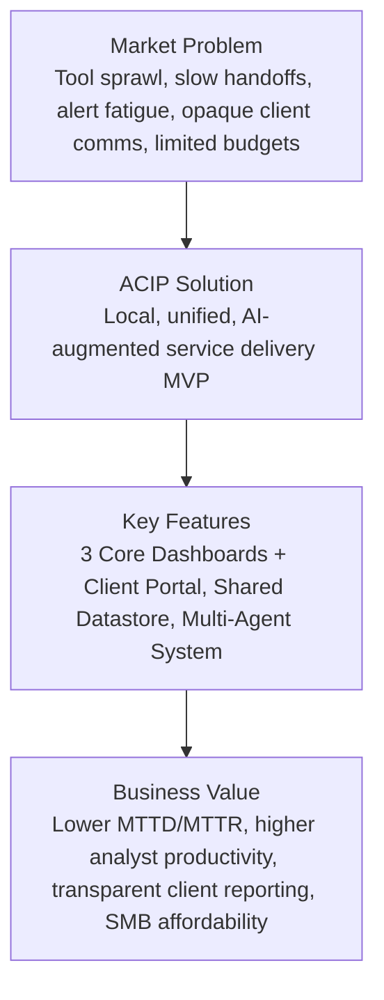

## Problem Statement & Economic Viability

MENA MSSPs face unsustainable operations driven by alert fatigue, siloed tools, manual context switching, and weak client communication. SMEs require affordable, outcome-driven security services with transparent reporting and fast remediation. ACIP replaces fragmented workflows with a unified, localhost platform that shortens MTTD/MTTR, aligns teams around shared artifacts, and provides client-ready narratives via AI.

## Project Goals

The goals are split into product outcomes (MVP) and academic outcomes to ensure feasibility, learning depth, and a credible market narrative.

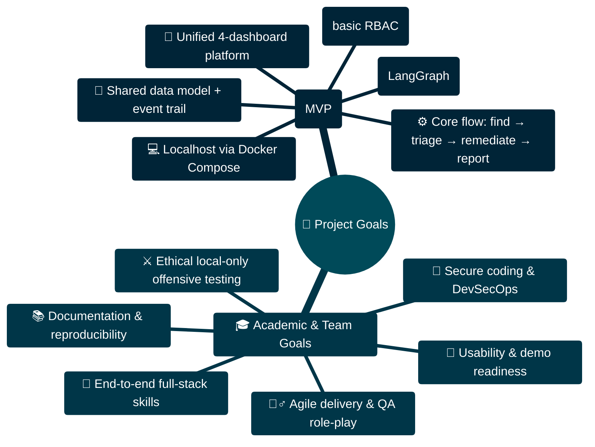

## Scope & MVP Feature Definition

Feasibility is enforced by a narrow, end-to-end slice that demonstrates commercial value without overextending the six-person team over five months.

```mermaid
graph TD
    ACIP[ACIP MVP]
    ACIP -->|In-Scope| IN[Core Features]
    ACIP -.->|Out-of-Scope| OUT[Future Enhancements]
    
    IN --> IN1[Red Team: Target scanning, evidence capture, basic TTP execution]
    IN --> IN2[SOC: Alert triage, correlation, AI summaries, ticket creation]
    IN --> IN3[DevSecOps: Ticket intake, AI fix suggestions, status updates]
    IN --> IN4[Client Portal: Live status dashboard, report downloads]
    IN --> IN5[Platform: Unified PostgreSQL, Dockerized localhost]
    IN --> IN6[AI: Multi-agent systems (Orchestrator, Router, Specialist) built with LangGraph]
    
    OUT --> OUT1[Cloud multi-tenancy and SSO]
    OUT --> OUT2[EDR/SIEM-scale ingestion]
    OUT --> OUT3[Autonomous exploitation]
    OUT --> OUT4[Advanced analytics & benchmarking]
    OUT --> OUT5["3rd-party integrations (Jira/Slack)"]
```

## System Architecture

The ACIP architecture is a modular, multi-agent system deployed locally via Docker Compose. It features three core operational dashboards (Red Team, SOC, DevSecOps) and a Client Portal, all interacting through a unified PostgreSQL database. Each dashboard is powered by a hierarchical team of AI agents, ensuring a clear separation of concerns and robust, auditable workflows.

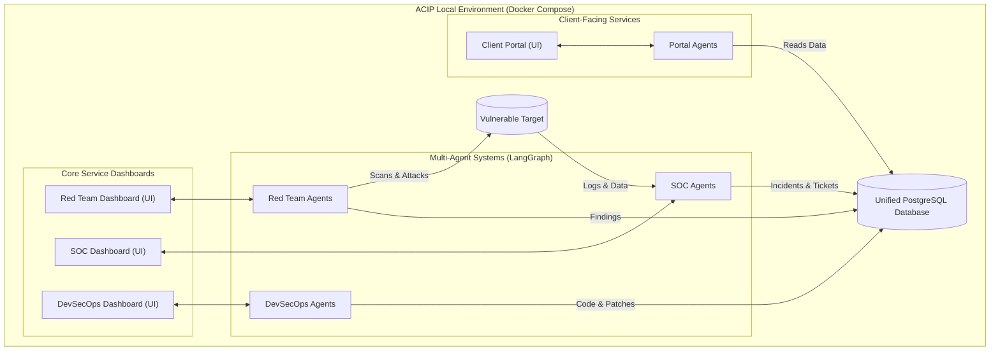

## Team Structure & Execution Plan

With a six-member team, we will adopt a parallelized development approach. The team will be divided into three pairs, with each pair taking ownership of one of the core dashboards (Red Team, SOC, DevSecOps). This structure promotes focused expertise while requiring strong communication for integration.

### Initial Two-Week Sprint: Orchestrator Agent Development

The project will kick off with a foundational two-week sprint dedicated to building the Layer 1 Orchestrator Agent for each of the three core dashboards. This is the most critical first step.

- Pair 1 (Red Team): Members A & B
- Pair 2 (SOC): Members C & D
- Pair 3 (DevSecOps): Members E & F

The objective of this sprint is to define the agent's primary function (high-level task analysis and decomposition) and establish the initial LangGraph state machine. This focused start ensures the core of each system is in place before developing the granular Layer 2 and Layer 3 agents in subsequent sprints.

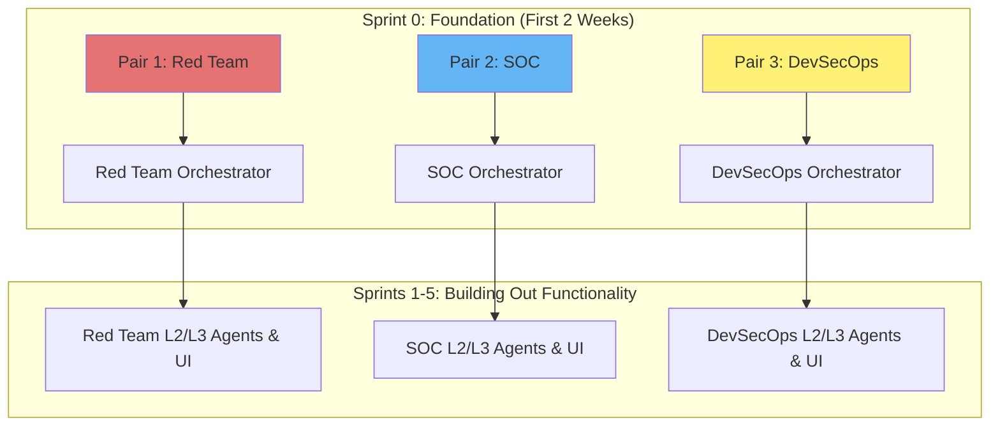

## AI Agents: Human-AI Teaming Design

Our AI strategy revolves around a hierarchical, multi-agent system (MAS) within each of the three core dashboards. This structure, built with LangGraph, ensures complexity is managed, tasks are delegated efficiently, and performance is evaluated at every level.

### The Three-Layer Agent Architecture

Each core dashboard (Red Team, SOC, DevSecOps) operates with the following three-tiered agent structure:

- **Layer 1: Orchestrator Agent**: The entry point for any high-level task. It analyzes the human operator's request or a system event, breaks it down into major sub-tasks, and delegates them to the appropriate agent groups in Layer 2.

- **Layer 2: Router Agent**: Sits within a specialized group of agents (e.g., the "Reconnaissance Group" or "Vulnerability Triaging Group"). It receives a task from the Orchestrator and routes it to the correct Specialized Agent in Layer 3 based on the task's specific requirements.

- **Layer 3: Specialized Agents**: These are the workhorses of the system. Each agent has a single, well-defined skill, such as RunNmapScan, AnalyzeLogEntry, or GenerateRemediationCode. They execute their task and return the result.

### Cross-Cutting Evaluator Agent

An Evaluator Agent operates at each layer. After an agent completes its work, the Evaluator assesses the output's quality, accuracy, and relevance. It then incorporates feedback from the human operator to create a performance score, which can be used to refine the agent's future actions, forming a crucial human-in-the-loop reinforcement learning (RLHF) mechanism.

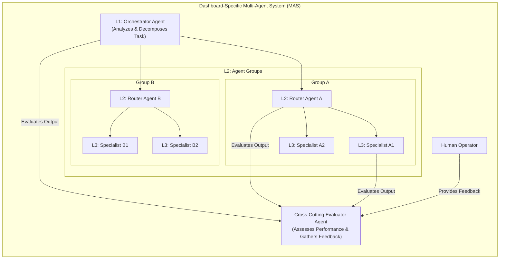

## Detailed Module Workflows

This section provides a detailed breakdown of the agent interactions within each core module, illustrating the practical application of our three-layer architecture.

### Red Team Workflow

The Red Team module automates the planning and execution of simulated attacks. The L1 Orchestrator takes high-level goals from the human operator and constructs an attack plan based on MITRE ATT&CK phases. Each phase is managed by an L2 Router which delegates specific tasks (like scanning or exploit identification) to L3 Specialist Agents. The Evaluator Agent reviews the outcomes of each phase before proceeding.

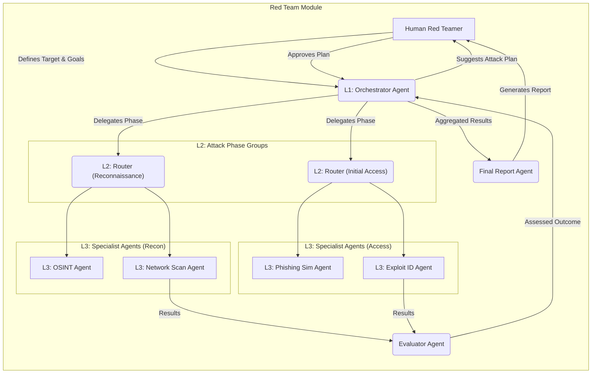

### SOC Workflow

In the SOC module, the L1 Orchestrator ingests data from various sources (SIEM, EDR). The L2 Router forwards this data to specialized L3 Detection Agents. When a potential threat is identified, it's sent back to the Orchestrator, which can then initiate an incident handling process, managed by another group of L3 Specialist Agents following the NIST lifecycle.

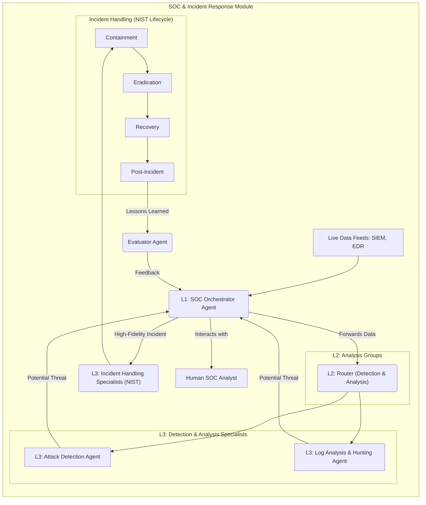

### DevSecOps Workflow

The DevSecOps workflow integrates security into the CI/CD pipeline. When code is pushed, L3 Specialist Scan Agents (SAST, SCA) are triggered. Their findings (in SARIF format) are sent to the L1 Orchestrator. An L2 Router then passes these findings to an L3 Triage Agent for prioritization. Critical vulnerabilities trigger an L3 Ticketing Agent to create an issue in a system like Jira.

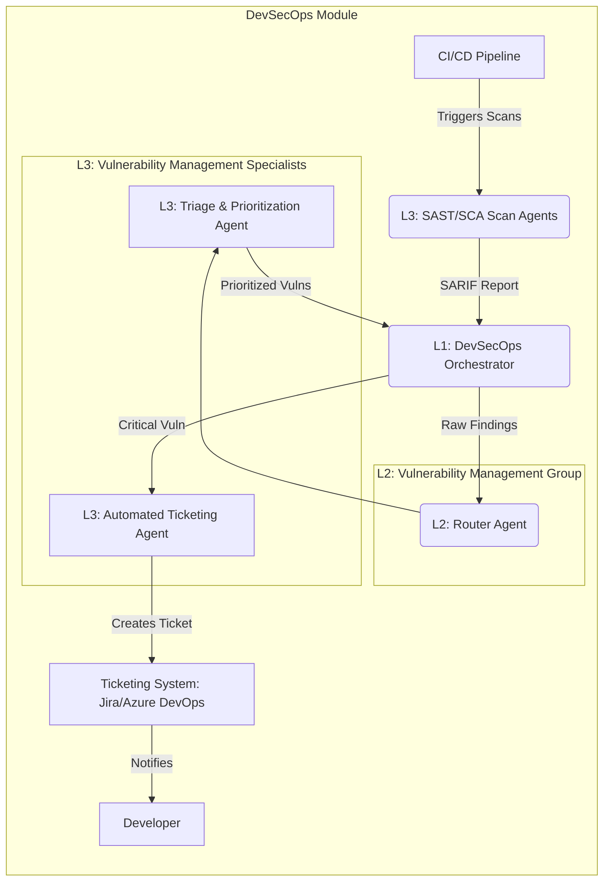

## Technical Stack

Our technology choices prioritize rapid development, local reproducibility, and powerful, observable AI agent architectures. The entire environment is designed to run on a local machine via Docker Compose.

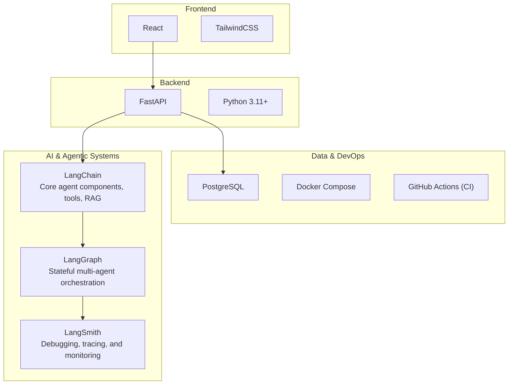

## Project Timeline (5-Month MVP Graduation Project)

This timeline is structured for a six-member team to deliver a compelling MVP over five months. It prioritizes the three core dashboards in the first three months, followed by the Client Portal and final integration.

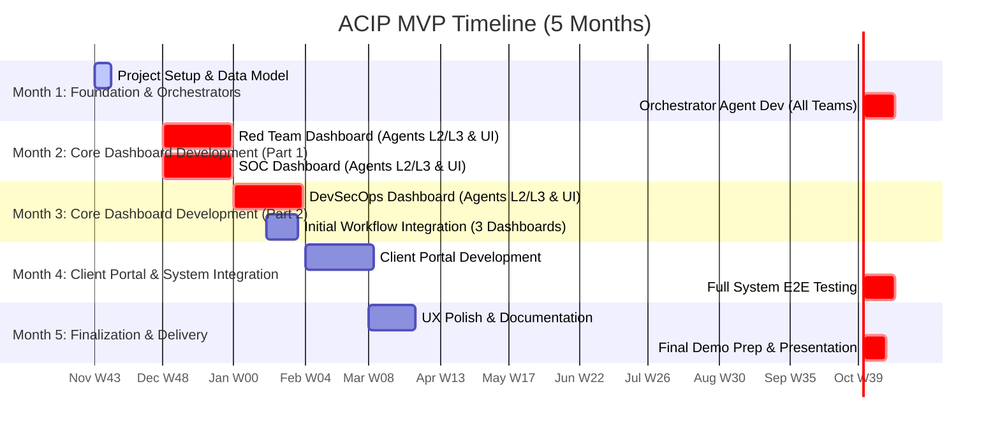

## Final Deliverables

Expected outputs align with academic rigor and commercial storytelling.

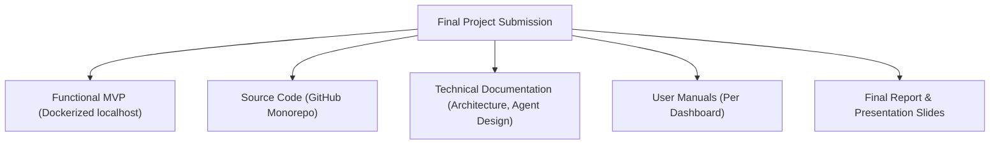

## Appendix A: Data Schema

The following Entity-Relationship Diagram (ERD) outlines the unified PostgreSQL database schema. It is designed to be the single source of truth for all modules, linking clients to engagements, incidents, vulnerabilities, and reports.

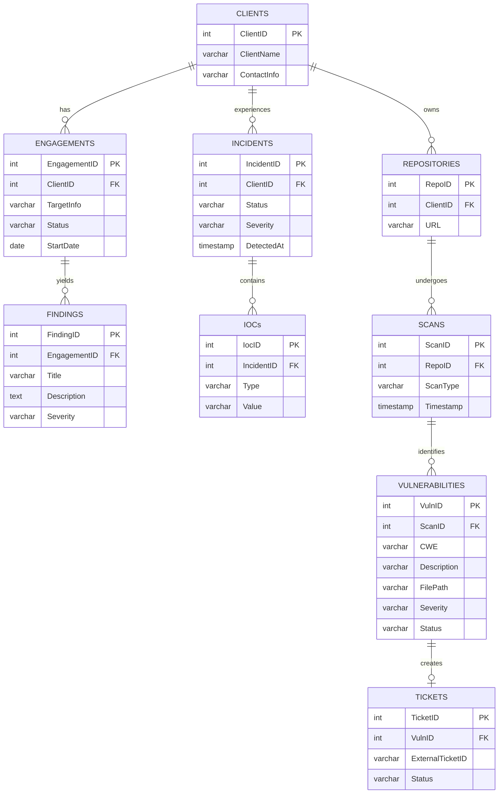
