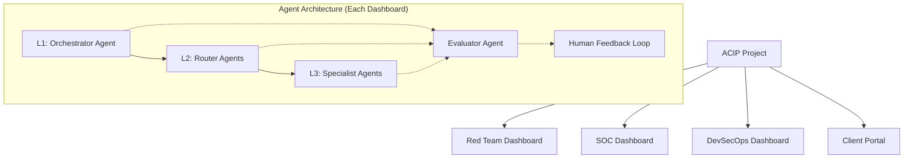
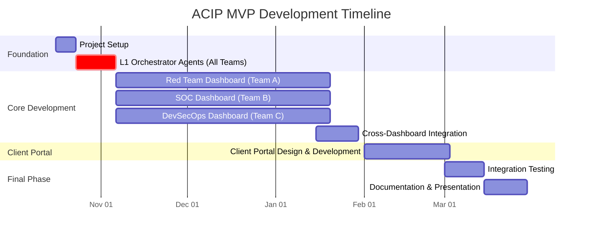
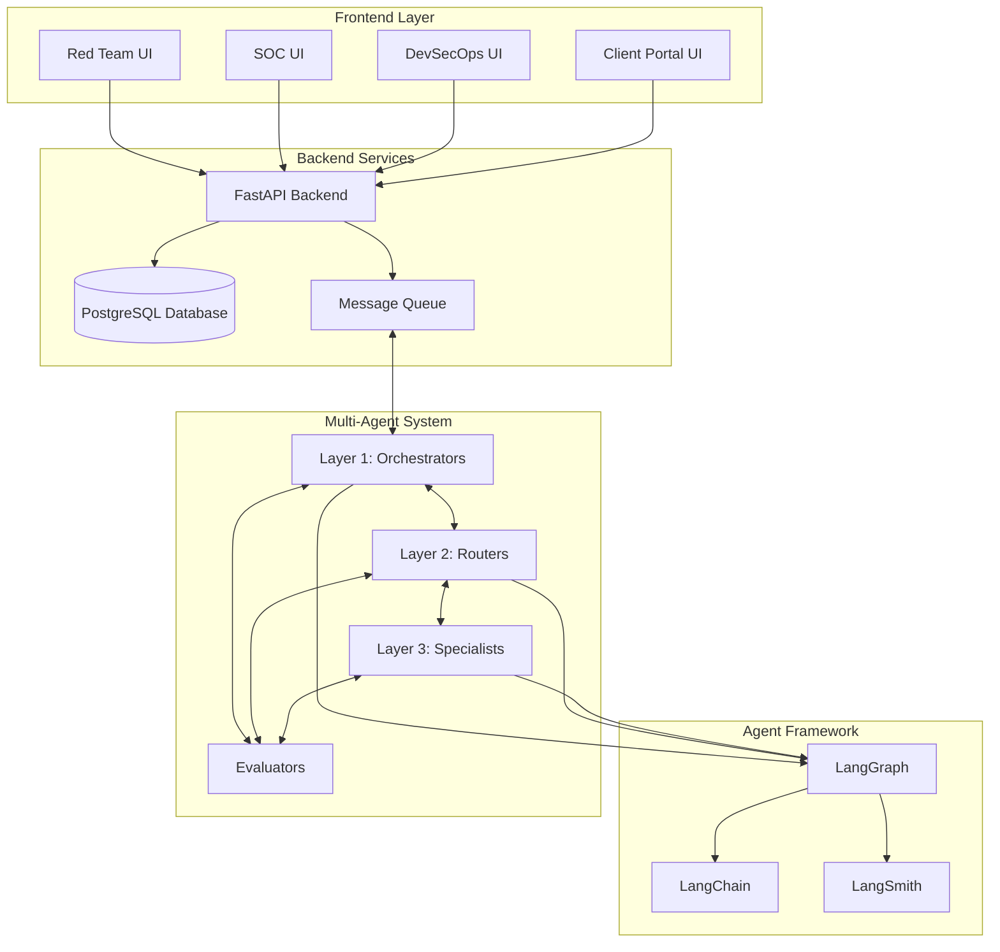

# Technical Project Plan: Advanced Cybersecurity Intelligence Platform (ACIP)

## Project Overview

The Advanced Cybersecurity Intelligence Platform (ACIP) is a graduation project focused on building a multi-agent cybersecurity system with three specialized dashboards and a client portal. The system uses a three-layer agent architecture powered by LangGraph, LangChain, and LangSmith, deployed in a localhost environment for MVP development.



## Team Organization

The 6-member team will be organized into three pairs, each responsible for one dashboard:

1. **Red Team Dashboard** - Team A (2 members)
2. **SOC Dashboard** - Team B (2 members)
3. **DevSecOps Dashboard** - Team C (2 members)

All teams will collaborate on the Client Portal in the later phases.

## Project Timeline (5 Months)



## Phase 1: First 2 Weeks - Orchestrator Agents Development

### Common Requirements for All Orchestrator Agents

**English:**
The Orchestrator Agent (L1) is the foundation of each dashboard's agent system. It analyzes high-level tasks, breaks them into subtasks, and delegates to appropriate L2 Router Agents. During these first two weeks, each team will:

1. Define the core functionality of your Orchestrator Agent
2. Map all possible high-level tasks that will enter your dashboard
3. Identify the necessary L2 agent groups that will be needed
4. Build the LangGraph state machine for your Orchestrator
5. Implement basic natural language understanding capabilities
6. Create evaluation metrics for the Orchestrator's performance
7. Design the interaction flow between the Orchestrator and human operator

**Arabic:**
وكيل المنسق (L1) هو أساس نظام الوكلاء في كل لوحة معلومات. يقوم بتحليل المهام عالية المستوى، وتقسيمها إلى مهام فرعية، والتفويض إلى وكلاء التوجيه L2 المناسبين. خلال الأسبوعين الأولين، سيقوم كل فريق بما يلي:

1. تحديد الوظائف الأساسية لوكيل المنسق الخاص بك
2. رسم خريطة لجميع المهام عالية المستوى التي ستدخل لوحة المعلومات الخاصة بك
3. تحديد مجموعات الوكلاء L2 اللازمة
4. بناء آلة حالة LangGraph للمنسق الخاص بك
5. تنفيذ قدرات فهم اللغة الطبيعية الأساسية
6. إنشاء مقاييس تقييم لأداء المنسق
7. تصميم تدفق التفاعل بين المنسق والمشغل البشري

## Specific Team Instructions

### Team A: Red Team Dashboard

**Orchestrator Focus (First 2 Weeks):**
1. Build an Orchestrator that can interpret penetration testing objectives and convert them to actionable attack plans
2. Design state management for attack campaigns that persist across sessions
3. Define clear interfaces for reconnaissance, exploitation, and post-exploitation agent groups
4. Implement MITRE ATT&CK mapping for all activities
5. Create templates for reporting findings back to the human operator

**Future Development (Months 1-3):**
- Develop L2 Router Agents for: Reconnaissance Group, Exploitation Group, Post-Exploitation Group
- Implement L3 Specialist Agents for specific tools (Nmap, exploit searchers, etc.)
- Build evaluation framework for attack effectiveness
- Design UI for attack planning and execution

### Team B: SOC Dashboard

**Orchestrator Focus (First 2 Weeks):**
1. Build an Orchestrator that can ingest security alerts and determine initial triage priorities
2. Design state management for ongoing incident investigations
3. Define interfaces for alert analysis, threat hunting, and incident response agent groups
4. Implement NIST incident response framework integration
5. Create templates for escalation paths and analyst recommendations

**Future Development (Months 1-3):**
- Develop L2 Router Agents for: Alert Triage Group, Threat Hunting Group, Incident Response Group
- Implement L3 Specialist Agents for log analysis, IOC matching, and containment procedures
- Build evaluation framework for detection accuracy
- Design UI for alert management and investigation tracking

### Team C: DevSecOps Dashboard

**Orchestrator Focus (First 2 Weeks):**
1. Build an Orchestrator that can process security scan results and vulnerability reports
2. Design state management for tracking vulnerabilities through remediation lifecycle
3. Define interfaces for vulnerability assessment, prioritization, and remediation agent groups
4. Implement integration points for common security scanning tools
5. Create templates for developer-friendly remediation guidance

**Future Development (Months 1-3):**
- Develop L2 Router Agents for: Vulnerability Scanning Group, Prioritization Group, Remediation Group
- Implement L3 Specialist Agents for SAST/DAST analysis, CVE matching, and code fix generation
- Build evaluation framework for remediation effectiveness
- Design UI for vulnerability management and remediation tracking

## Development Standards

For all teams:

1. Use GitHub for version control with branch protection and PR reviews
2. Write unit tests for all agent components
3. Document agent specifications and interfaces
4. Use Docker for containerization of all components
5. Implement secure coding practices
6. Track progress using Agile methodologies (weekly sprints)
7. Conduct regular cross-team syncs to ensure integration compatibility

## Technical Architecture



## Orchestrator Agent Implementation Guidelines

### Key Components for All Orchestrators

1. **Task Analyzer**: Parse and understand incoming requests
2. **Task Decomposer**: Break complex tasks into manageable subtasks
3. **Resource Allocator**: Determine which agent groups should handle subtasks
4. **State Manager**: Track progress of tasks and maintain context
5. **Communication Interface**: Handle interactions with human operators
6. **Evaluation Handler**: Process feedback and improve performance

### LangGraph Implementation Template

```python
from langgraph.graph import StateGraph
from typing import TypedDict, List, Dict
import langchain

# Define state schema
class AgentState(TypedDict):
    task: str
    subtasks: List[Dict]
    current_subtask: int
    context: Dict
    results: List[Dict]
    feedback: Dict
    status: str

# Initialize agents
orchestrator_agent = langchain.agents.create_agent(...)
evaluator_agent = langchain.agents.create_agent(...)

# Define state transitions
def analyze_task(state: AgentState) -> AgentState:
    # Implementation
    return updated_state

def decompose_task(state: AgentState) -> AgentState:
    # Implementation
    return updated_state

def assign_subtasks(state: AgentState) -> AgentState:
    # Implementation
    return updated_state

def process_results(state: AgentState) -> AgentState:
    # Implementation
    return updated_state

def handle_feedback(state: AgentState) -> AgentState:
    # Implementation
    return updated_state

# Create state graph
workflow = StateGraph(AgentState)
workflow.add_node("analyze_task", analyze_task)
workflow.add_node("decompose_task", decompose_task)
workflow.add_node("assign_subtasks", assign_subtasks)
workflow.add_node("process_results", process_results)
workflow.add_node("handle_feedback", handle_feedback)

# Connect nodes
workflow.add_edge("analyze_task", "decompose_task")
workflow.add_edge("decompose_task", "assign_subtasks")
workflow.add_edge("assign_subtasks", "process_results")
workflow.add_edge("process_results", "handle_feedback")
workflow.add_conditional_edges(...)

# Compile graph
orchestrator_graph = workflow.compile()
```

## Weekly Checkpoints for First 2 Weeks

### Week 1
- Day 1-2: Define agent requirements and scope
- Day 3-4: Design agent state machine
- Day 5: Review designs across teams for integration points

### Week 2
- Day 1-3: Implement core Orchestrator functionality
- Day 4: Testing and evaluation
- Day 5: Demo and handoff for next phase

## تعليمات عامة باللغة العربية

### الإرشادات الفنية الرئيسية للفرق الثلاثة:

1. **البناء التدريجي**: ابدأ بإنشاء نموذج أولي بسيط لوكيل المنسق قبل إضافة الميزات المتقدمة.
2. **التوثيق المستمر**: وثّق قرارات التصميم وواجهات البرمجة أثناء التطوير.
3. **الاختبار المنتظم**: اختبر كل مكون بشكل منفصل قبل دمجه مع بقية النظام.
4. **التكامل المبكر**: حدد نقاط التكامل بين الوكلاء والأنظمة المختلفة في وقت مبكر.
5. **الاجتماعات اليومية**: عقد اجتماعات قصيرة يومية لمناقشة التقدم والتحديات.

يجب على كل فريق إنشاء مستودع GitHub خاص به واستخدام نظام تتبع المشكلات لإدارة المهام. سيكون هناك اجتماع أسبوعي لعرض التقدم ومناقشة التحديات التقنية.

## Conclusion

This technical plan provides a structured approach for developing the ACIP multi-agent system within the 5-month timeframe. By focusing the first 2 weeks on the critical Orchestrator agents, teams will establish a solid foundation for the more specialized agents to follow. The clear division of responsibilities between the three teams, coupled with regular integration points, will ensure the system functions coherently while allowing for parallel development.
