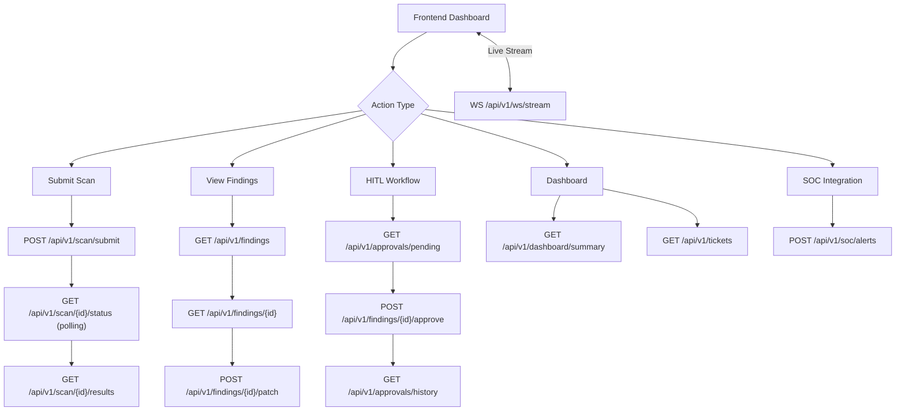

# 📡 ACIP DevSecOps Module — API Documentation

<<<<<<< HEAD
> **Base URL:** `http://localhost:8000`
> **AI Model:** `codellama:13b-instruct` via Ollama
> **Version:** `1.0.0`
> **Interactive Docs (Swagger):** [`http://localhost:8000/docs`](http://localhost:8000/docs)
=======
> **Base URL on same device:** `http://localhost:8000` 
> **Base URL on network:** `http://[IP_ADDRESS]` 
> **AI Model:** `codellama:13b-instruct` via Ollama 
> **Version:** `1.0.0` 
> **Interactive Docs (Swagger):** [`http://localhost:8000/docs`](http://localhost:8000/docs) 
> **Interactive Docs (Swagger) on network:** [`http://[IP_ADDRESS]/docs`](http://[IP_ADDRESS]/docs) 
>>>>>>> fe593c7172cd4a511612aa8f3ba161b83e2d879f

---

## 📋 جدول المحتويات

| # | المجموعة | Endpoint | Method |
|---|---|---|---|
| 1 | Health | `/` | GET |
| 2 | Scans | `/api/v1/scan/submit` | POST |
| 3 | Scans | `/api/v1/scan/{scan_id}/status` | GET |
| 4 | Scans | `/api/v1/scan/{scan_id}/results` | GET |
| 5 | SOC | `/api/v1/soc/alerts` | POST |
| 6 | Findings | `/api/v1/findings` | GET |
| 7 | Findings | `/api/v1/findings/{finding_id}` | GET |
| 8 | Auto-Patch | `/api/v1/findings/{finding_id}/patch` | POST |
| 9 | HITL | `/api/v1/approvals/pending` | GET |
| 10 | HITL | `/api/v1/findings/{finding_id}/approve` | POST |
| 11 | HITL | `/api/v1/approvals/history` | GET |
| 12 | Tickets | `/api/v1/tickets` | GET |
| 13 | Dashboard | `/api/v1/dashboard/summary` | GET |
| 14 | WebSocket | `/api/v1/ws/stream` | WS |

---

## 🟢 1. Health Check

**`GET /`**

تحقق من أن السيرفر يعمل ويعرض المعلومات الأساسية عن الموديل.

### Response

```json
{
  "service_status": "Running",
  "module_name": "devsecops",
  "version": "1.0.0",
  "model": "codellama:13b-instruct",
  "ollama_url": "http://localhost:11434"
}
```

### Frontend Integration

```javascript
// مثال: عرض حالة السيرفر في الـ navbar
const checkHealth = async () => {
  const res = await fetch('http://localhost:8000/');
  const data = await res.json();
  setServerStatus(data.service_status); // "Running"
  setModel(data.model);                 // "codellama:13b-instruct"
};
```

---

<<<<<<< HEAD
## 15. Endpoint Telemetry

**`POST /api/v1/endpoints/events`**

Ingest endpoint / EDR-style telemetry into the DevSecOps module so the dashboard can track workstation and server events alongside scan findings.

### Example Request

```json
{
  "endpoint_id": "host-001",
  "hostname": "finance-laptop-01",
  "platform": "windows",
  "event_type": "powershell_suspicious_script",
  "severity": 8.4,
  "title": "Suspicious PowerShell execution",
  "description": "Encoded command execution detected from Office parent process.",
  "user_name": "analyst1",
  "process_name": "powershell.exe",
  "parent_process": "winword.exe",
  "tags": ["edr", "powershell", "lolbin"]
}
```

### Example Response

```json
{
  "status": "received",
  "event_id": "evt_123456789abc",
  "endpoint_id": "host-001",
  "risk_level": "HIGH",
  "processing_status": "ESCALATED",
  "recommended_action": "Review the executed script, validate parent process chain, and restrict execution policy.",
  "message": "Endpoint telemetry ingested successfully."
}
```

### Additional Endpoint APIs

- **`GET /api/v1/endpoints/summary`**: Returns counts, escalations, recent endpoint events, and endpoint risk distribution.
- **`GET /api/v1/endpoints/events`**: Lists ingested endpoint events. Supports `endpoint_id`, `risk_level`, and `limit`.
- **`GET /api/v1/endpoints/{endpoint_id}`**: Returns the endpoint posture snapshot plus the last events seen for that host.

---

=======
>>>>>>> fe593c7172cd4a511612aa8f3ba161b83e2d879f
## 📤 2. رفع Scan جديد

**`POST /api/v1/scan/submit`**

يرفع نتائج SAST/DAST scan ليبدأ الـ pipeline الكامل للتحليل والتصحيح التلقائي.

### Request Body

```json
{
  "sarif_data": {
    "runs": [
      {
        "tool": { "driver": { "name": "Semgrep" } },
        "results": [
          {
            "ruleId": "python.lang.security.sql-injection",
            "level": "error",
            "message": { "text": "SQL Injection vulnerability" },
            "locations": [
              {
                "physicalLocation": {
                  "artifactLocation": { "uri": "app/db.py" },
                  "region": { "startLine": 42 }
                }
              }
            ]
          }
        ]
      }
    ]
  },
  "commit_id": "abc123def456"
}
```

| الحقل | النوع | إلزامي | الوصف |
|---|---|---|---|
| `sarif_data` | `object` or `array` | ✅ | بيانات الـ SARIF من أداة الـ scan |
| `commit_id` | `string` | ❌ | رقم الـ commit (يُولَّد تلقائياً إذا لم يُحدَّد) |

### Response

```json
{
  "scan_id": "550e8400-e29b-41d4-a716-446655440000",
  "status": "PATCHED",
  "final_score": 8.7,
  "risk_level": "HIGH",
  "jira_ticket_id": "SEC-1042",
  "patch_generated": true,
  "human_approval_required": true,
  "message": "Scan processed successfully. 3 findings analyzed."
}
```

### Frontend Integration

```javascript
const submitScan = async (sarifData, commitId) => {
  const res = await fetch('http://localhost:8000/api/v1/scan/submit', {
    method: 'POST',
    headers: { 'Content-Type': 'application/json' },
    body: JSON.stringify({
      sarif_data: sarifData,
      commit_id: commitId
    })
  });

  if (!res.ok) throw new Error('Scan submission failed');
  
  const data = await res.json();
  // data.scan_id → استخدمه لمتابعة النتائج لاحقاً
  // data.human_approval_required → إذا true، اعرض واجهة الموافقة
  return data;
};
```

> [!IMPORTANT]
> هذا الـ endpoint يشغّل الـ pipeline الكامل بشكل **متزامن (synchronous)**. قد يستغرق وقتاً حسب حجم الـ scan. يُنصح باستخدام **loading state** في الفرونت.

---

## 🔍 3. حالة الـ Scan

**`GET /api/v1/scan/{scan_id}/status`**

استعلام سريع عن حالة الـ scan بدون تفاصيل كاملة.

### Path Parameters

| الحقل | الوصف |
|---|---|
| `scan_id` | الـ UUID المُستقبَل من endpoint رقم 2 |

### Response

```json
{
  "scan_id": "550e8400-e29b-41d4-a716-446655440000",
  "status": "PATCHED",
  "final_score": 8.7,
  "risk_level": "HIGH"
}
```

**قيم الـ `status` المحتملة:**

| القيمة | المعنى |
|---|---|
| `PATCHED` | تم توليد patch ناجح |
| `PENDING_HITL` | في انتظار موافقة بشرية |
| `AUTO_APPROVED` | تمت الموافقة التلقائية |
| `SKIPPED` | تم تخطيه (درجة منخفضة) |
| `FAILED` | فشل الـ pipeline |

**قيم الـ `risk_level`:**

| القيمة | النطاق |
|---|---|
| `CRITICAL` | score ≥ 9.0 |
| `HIGH` | score ≥ 7.0 |
| `MEDIUM` | score ≥ 4.0 |
| `LOW` | score > 0 |
| `NONE` | score = 0 |

### Frontend Integration

```javascript
// Polling لمتابعة الحالة
const pollScanStatus = async (scanId) => {
  const interval = setInterval(async () => {
    const res = await fetch(`http://localhost:8000/api/v1/scan/${scanId}/status`);
    const data = await res.json();
    
    updateStatusBadge(data.status, data.risk_level);
    
    if (data.status !== 'PROCESSING') {
      clearInterval(interval); // إيقاف الـ polling بعد الانتهاء
    }
  }, 3000); // كل 3 ثوانٍ
};
```

---

## 📦 4. نتائج الـ Scan الكاملة

**`GET /api/v1/scan/{scan_id}/results`**

جلب التقرير الكامل لـ scan معين يشمل الـ findings والـ patch والـ AI thoughts.

### Response

```json
{
  "scan_id": "550e8400-e29b-41d4-a716-446655440000",
  "commit_id": "abc123def456",
  "submitted_at": "2026-04-12T10:00:00Z",
  "status": "PATCHED",
  "final_score": 8.7,
  "risk_level": "HIGH",
  "jira_ticket_id": "SEC-1042",
  "patch_generated": true,
  "patch_suggestion": "# Fixed code:\ndef get_user(id):\n    cursor.execute('SELECT * FROM users WHERE id = ?', (id,))",
  "human_approval_required": true,
  "hitl_message": "High-risk patch requires analyst approval",
  "ai_thought_process": "Analyzing SQL injection in db.py line 42...",
  "findings": [
    {
      "finding_id": "fin_abc123",
      "rule_id": "python.lang.security.sql-injection",
      "file_path": "app/db.py",
      "line_number": 42,
      "tool_severity": 8.7,
      "message": "SQL Injection vulnerability"
    }
  ]
}
```

### Frontend Integration

```javascript
const getScanResults = async (scanId) => {
  const res = await fetch(`http://localhost:8000/api/v1/scan/${scanId}/results`);
  if (res.status === 404) {
    showError('Scan not found');
    return;
  }
  const data = await res.json();

  // عرض الـ findings في جدول
  renderFindingsTable(data.findings);

  // عرض الـ patch في code editor
  if (data.patch_generated) {
    renderPatchViewer(data.patch_suggestion);
  }

  // عرض تفكير الـ AI
  setAIThoughts(data.ai_thought_process);
};
```

---

## 🚨 5. استقبال SOC Alert

**`POST /api/v1/soc/alerts`**

يستقبل تنبيهات أمنية من وحدة SOC ويصنفها تلقائياً إما كثغرة كود أو تهديد شبكي.

### Request Body

```json
{
  "alert_id": "soc-alert-001",
  "alert_type": "code_vulnerability",
  "severity": 9.1,
  "title": "Critical SQL Injection Detected",
  "description": "SQL injection found in user authentication module",
  "source_module": "soc",
  "affected_target": "192.168.56.101",
  "code_snippet": "cursor.execute('SELECT * FROM users WHERE id=' + user_id)",
  "file_path": "auth/login.py",
  "network_details": null,
  "raw_data": {},
  "timestamp": "2026-04-12T10:00:00Z"
}
```

| الحقل | النوع | إلزامي | الوصف |
|---|---|---|---|
| `alert_id` | `string` | ✅ | معرف فريد للتنبيه |
| `alert_type` | `string` | ✅ | `"code_vulnerability"` أو `"network_threat"` |
| `severity` | `float` | ✅ | درجة الخطورة (0-10) |
| `title` | `string` | ✅ | عنوان التنبيه |
| `description` | `string` | ✅ | وصف التنبيه |
| `affected_target` | `string` | ❌ | IP أو hostname المستهدف |
| `code_snippet` | `string` | ❌ | مقتطف الكود المعيب (للثغرات البرمجية) |
| `file_path` | `string` | ❌ | مسار الملف |
| `network_details` | `object` | ❌ | تفاصيل الشبكة (للتهديدات الشبكية) |

### Response

```json
{
  "status": "received",
  "alert_id": "soc-alert-001",
  "classification": "code_vulnerability",
  "processing_status": "processing",
  "message": "Alert received and classified. Processing initiated."
}
```

### Frontend Integration

```javascript
const sendSOCAlert = async (alertData) => {
  const res = await fetch('http://localhost:8000/api/v1/soc/alerts', {
    method: 'POST',
    headers: { 'Content-Type': 'application/json' },
    body: JSON.stringify(alertData)
  });
  const data = await res.json();
  
  // classification: "code_vulnerability" → عرض في قسم الـ Code Issues
  // classification: "network_threat"     → عرض في قسم الـ Network Threats
  routeAlertToPanel(data.classification, data.alert_id);
};
```

---

## 📋 6. قائمة الـ Findings

**`GET /api/v1/findings?risk_level=HIGH&limit=50`**

جلب جميع الـ findings عبر كل الـ scans مع دعم الفلترة.

### Query Parameters

| الحقل | النوع | الافتراضي | الوصف |
|---|---|---|---|
| `risk_level` | `string` | `null` | فلترة: `CRITICAL`, `HIGH`, `MEDIUM`, `LOW` |
| `limit` | `integer` | `50` | الحد الأقصى للنتائج |

### Response

```json
{
  "total": 12,
  "findings": [
    {
      "finding_id": "fin_abc123",
      "rule_id": "python.lang.security.sql-injection",
      "file_path": "app/db.py",
      "line_number": 42,
      "tool_severity": 8.7,
      "message": "SQL Injection vulnerability",
      "scan_id": "550e8400-...",
      "commit_id": "abc123",
      "overall_score": 8.7
    }
  ]
}
```

### Frontend Integration

```javascript
const loadFindings = async (riskFilter = null) => {
  const params = new URLSearchParams({ limit: 100 });
  if (riskFilter) params.append('risk_level', riskFilter);

  const res = await fetch(`http://localhost:8000/api/v1/findings?${params}`);
  const { findings, total } = await res.json();

  // عرض كـ data table مع badge للـ risk level
  renderFindingsTable(findings);
  setTotalCount(total);
};

// مثال: فلتر بالـ Critical فقط
loadFindings('CRITICAL');
```

---

## 🔎 7. تفاصيل Finding محدد

**`GET /api/v1/findings/{finding_id}`**

جلب التفاصيل الكاملة لثغرة واحدة بما فيها الـ patch إن وُجد.

### Response

```json
{
  "finding_id": "fin_abc123",
  "rule_id": "python.lang.security.sql-injection",
  "file_path": "app/db.py",
  "line_number": 42,
  "tool_severity": 8.7,
  "message": "SQL Injection vulnerability",
  "scan_id": "550e8400-...",
  "commit_id": "abc123",
  "overall_score": 8.7,
  "patch_available": true,
  "patch_suggestion": "# Fixed:\ncursor.execute('SELECT * FROM users WHERE id = ?', (id,))"
}
```

### Frontend Integration

```javascript
const openFindingDetails = async (findingId) => {
  const res = await fetch(`http://localhost:8000/api/v1/findings/${findingId}`);
  if (res.status === 404) { showToast('Finding not found', 'error'); return; }

  const data = await res.json();
  openSidePanel({
    title: data.rule_id,
    severity: data.tool_severity,
    file: `${data.file_path}:${data.line_number}`,
    patchAvailable: data.patch_available,
    patch: data.patch_suggestion
  });
};
```

---

## 🧪 8. طلب Auto-Patch لثغرة

**`POST /api/v1/findings/{finding_id}/patch`**

يطلب من الـ AI توليد patch لثغرة معينة. النتيجة تحتاج موافقة HITL قبل التطبيق.

### Request Body (اختياري)

```json
{
  "vulnerability_type": "sql-injection"
}
```

### Response

```json
{
  "finding_id": "fin_abc123",
  "patch_status": "GENERATED",
  "patched_code": "def get_user(id):\n    cursor.execute('SELECT * FROM users WHERE id = ?', (id,))",
  "explanation": "Replaced string concatenation with parameterized query to prevent SQL injection",
  "requires_approval": true
}
```

### Frontend Integration

```javascript
const requestPatch = async (findingId) => {
  setLoading(true);
  const res = await fetch(`http://localhost:8000/api/v1/findings/${findingId}/patch`, {
    method: 'POST',
    headers: { 'Content-Type': 'application/json' },
    body: JSON.stringify({})
  });
  const data = await res.json();
  setLoading(false);

  // عرض الكود المُصلَح في code diff viewer
  renderCodeDiff(data.patched_code, data.explanation);

  // إظهار زر "إرسال للموافقة" إذا كان requires_approval = true
  if (data.requires_approval) {
    showApprovalButton(findingId);
  }
};
```

> [!NOTE]
> هذا الـ endpoint يشغّل الـ AI مباشرة. سيكون هناك تأخير بحسب حجم الكود وسرعة موديل `codellama:13b-instruct`.

---

## ⏳ 9. قائمة الانتظار — HITL Pending

**`GET /api/v1/approvals/pending`**

جلب جميع الإجراءات التي تنتظر موافقة المحلل الأمني.

### Response

```json
{
  "total": 2,
  "pending": [
    {
      "request_id": "req_xyz789",
      "description": "Patch for SQL injection in app/db.py",
      "created_at": "2026-04-12T10:05:00Z",
      "data": {
        "finding_id": "fin_abc123",
        "patch_suggestion": "..."
      }
    }
  ]
}
```

### Frontend Integration

```javascript
// عرض badge عدد الطلبات المعلقة في الـ navbar
const loadPendingCount = async () => {
  const res = await fetch('http://localhost:8000/api/v1/approvals/pending');
  const { total } = await res.json();
  setPendingBadge(total); // مثل: "🔔 2 Pending"
};

// تحديث كل 30 ثانية
setInterval(loadPendingCount, 30000);
```

---

## ✅ 10. إرسال قرار HITL

**`POST /api/v1/findings/{finding_id}/approve`**

إرسال قرار الموافقة أو الرفض على إجراء أمني من قِبَل المحلل.

### Request Body

```json
{
  "decision": "approved",
  "decided_by": "security_analyst_01",
  "notes": "Patch reviewed and verified. Safe to apply."
}
```

| الحقل | النوع | الوصف |
|---|---|---|
| `decision` | `string` | `"approved"` أو `"rejected"` أو `"modified"` |
| `decided_by` | `string` | اسم أو ID المحلل |
| `notes` | `string` | تعليق المحلل |

### Response

```json
{
  "finding_id": "fin_abc123",
  "decision": "approved",
  "decided_by": "security_analyst_01",
  "status": "processed"
}
```

### Frontend Integration

```javascript
const submitApproval = async (findingId, decision, analystName, notes) => {
  const res = await fetch(`http://localhost:8000/api/v1/findings/${findingId}/approve`, {
    method: 'POST',
    headers: { 'Content-Type': 'application/json' },
    body: JSON.stringify({ decision, decided_by: analystName, notes })
  });

  if (res.status === 404) {
    showToast('No pending approval found for this finding', 'warning');
    return;
  }

  const data = await res.json();
  showToast(`Decision "${data.decision}" submitted successfully`, 'success');
  
  // تحديث الـ pending list
  loadPendingCount();
};
```

---

## 📜 11. سجل قرارات HITL

**`GET /api/v1/approvals/history`**

جلب تاريخ جميع قرارات HITL المُعالَجة.

### Response

```json
{
  "total": 5,
  "history": [
    {
      "request_id": "req_xyz789",
      "decision": "approved",
      "decided_by": "security_analyst_01",
      "decided_at": "2026-04-12T10:10:00Z",
      "notes": "Verified and safe"
    }
  ]
}
```

### Frontend Integration

```javascript
const loadApprovalHistory = async () => {
  const res = await fetch('http://localhost:8000/api/v1/approvals/history');
  const { history } = await res.json();
  renderAuditLog(history); // جدول سجل مراجعة
};
```

---

## 🎫 12. قائمة Jira Tickets

**`GET /api/v1/tickets`**

جلب جميع الـ tickets التي تم إنشاؤها في Jira عبر كل الـ scans.

### Response

```json
{
  "total": 3,
  "tickets": [
    {
      "ticket_id": "SEC-1042",
      "scan_id": "550e8400-...",
      "commit_id": "abc123",
      "final_score": 8.7,
      "risk_level": "HIGH",
      "status": "PATCHED",
      "patch_available": true
    }
  ]
}
```

### Frontend Integration

```javascript
const loadTickets = async () => {
  const res = await fetch('http://localhost:8000/api/v1/tickets');
  const { tickets, total } = await res.json();
  renderTicketsTable(tickets);
  // Jira ticket link: `https://your-jira.com/browse/${ticket.ticket_id}`
};
```

---

## 📊 13. Dashboard Summary

**`GET /api/v1/dashboard/summary`**

أهم endpoint للـ dashboard — يُعطي نظرة شاملة عن كل النشاط الأمني.

### Response

```json
{
  "module_name": "devsecops",
  "model": "codellama:13b-instruct",
  "summary": {
    "total_scans": 15,
    "total_findings": 42,
    "critical_findings": 5,
    "tickets_created": 8,
    "patches_generated": 11,
    "pending_approvals": 2
  },
  "risk_distribution": {
    "CRITICAL": 5,
    "HIGH": 12,
    "MEDIUM": 18,
    "LOW": 7,
    "NONE": 0
  },
  "recent_scans": [
    {
      "scan_id": "550e8400-...",
      "status": "PATCHED",
      "score": 8.7,
      "risk_level": "HIGH",
      "submitted_at": "2026-04-12T10:00:00Z"
    }
  ]
}
```

### Frontend Integration

```javascript
const loadDashboard = async () => {
  const res = await fetch('http://localhost:8000/api/v1/dashboard/summary');
  const data = await res.json();

  // KPI Cards
  setKPIs({
    totalScans: data.summary.total_scans,
    criticalFindings: data.summary.critical_findings,
    pendingApprovals: data.summary.pending_approvals,
    patchesGenerated: data.summary.patches_generated,
  });

  // Pie / Donut Chart
  renderRiskChart(data.risk_distribution);

  // Recent Activity Table
  renderRecentScans(data.recent_scans);
  
  // Model info
  setModelBadge(data.model);
};

// تحديث كل دقيقة
setInterval(loadDashboard, 60000);
```

---

## 🔌 14. WebSocket — Live AI Stream

**`WS /api/v1/ws/stream`**

اتصال WebSocket يُبثّ أفكار الـ AI والأحداث في الوقت الفعلي للـ dashboard.

### Connection

```javascript
const ws = new WebSocket('ws://localhost:8000/api/v1/ws/stream');

ws.onopen = () => {
  console.log('Connected to AI Stream');
  setConnectionStatus('live');
};

ws.onmessage = (event) => {
  const msg = JSON.parse(event.data);
  
  // msg.type: "ack" | "thought" | "finding" | "patch" | "alert"
  switch (msg.type) {
    case 'thought':
      appendAIThought(msg.content);
      break;
    case 'finding':
      addNewFinding(msg.data);
      break;
    case 'patch':
      showPatchReady(msg.data);
      break;
  }
};

ws.onclose = () => {
  setConnectionStatus('disconnected');
  // إعادة الاتصال بعد 5 ثوانٍ
  setTimeout(connectWebSocket, 5000);
};

// إرسال رسالة للسيرفر (اختياري)
ws.send('ping');
```

### Message Format المُستقبَل

```json
{
  "type": "ack",
  "message": "Received: ping",
  "timestamp": "2026-04-12T10:15:00Z"
}
```

---

## 🔐 CORS Configuration

الـ API مُهيَّأ لقبول طلبات من أي origin (`*`). في الـ production، قم بتغيير ذلك في `app.py`:

```python
# السطر 49 في app.py — قيّد الـ origins في الإنتاج
allow_origins=["http://localhost:3000", "https://your-dashboard.com"]
```

---

## 🗺️ خريطة تدفق الفرونت مع الـ API



---

## ⚡ Quick Reference — Fetch Examples

```javascript
const API = 'http://localhost:8000';

export const DevSecOpsAPI = {
  // Health
  health:              () => fetch(`${API}/`),

  // Scans
  submitScan:          (data) => fetch(`${API}/api/v1/scan/submit`, { method: 'POST', body: JSON.stringify(data), headers: {'Content-Type':'application/json'} }),
  getScanStatus:       (id)   => fetch(`${API}/api/v1/scan/${id}/status`),
  getScanResults:      (id)   => fetch(`${API}/api/v1/scan/${id}/results`),

  // SOC
  sendAlert:           (data) => fetch(`${API}/api/v1/soc/alerts`, { method: 'POST', body: JSON.stringify(data), headers: {'Content-Type':'application/json'} }),

  // Findings
  listFindings:        (risk, limit=50) => fetch(`${API}/api/v1/findings?${risk ? `risk_level=${risk}&` : ''}limit=${limit}`),
  getFinding:          (id)   => fetch(`${API}/api/v1/findings/${id}`),
  requestPatch:        (id)   => fetch(`${API}/api/v1/findings/${id}/patch`, { method: 'POST', body: '{}', headers: {'Content-Type':'application/json'} }),

  // HITL
  getPendingApprovals: ()     => fetch(`${API}/api/v1/approvals/pending`),
  submitApproval:      (id, data) => fetch(`${API}/api/v1/findings/${id}/approve`, { method: 'POST', body: JSON.stringify(data), headers: {'Content-Type':'application/json'} }),
  getApprovalHistory:  ()     => fetch(`${API}/api/v1/approvals/history`),

  // Tickets & Dashboard
  listTickets:         ()     => fetch(`${API}/api/v1/tickets`),
  getDashboard:        ()     => fetch(`${API}/api/v1/dashboard/summary`),

  // WebSocket
  connectStream:       ()     => new WebSocket('ws://localhost:8000/api/v1/ws/stream'),
};
```
