# 🎨 ACIP DevSecOps — Frontend & Endpoints Mapping Document

> هذا التوثيق يوضح بشكل رسومي هيكل الفرونت إند المقترح وأماكن ربط كل endpoint من الـ API.

---

## 📐 الهيكل العام للفرونت إند (Frontend Architecture)

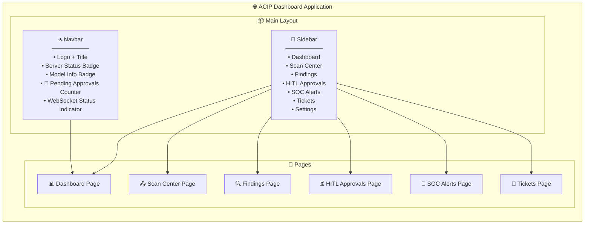

---

## 🗺️ خريطة الصفحات والـ Endpoints

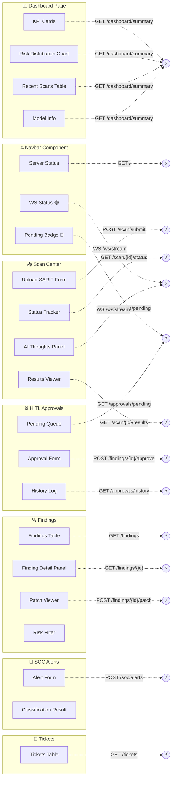

---

## 📊 صفحة 1: Dashboard (الصفحة الرئيسية)

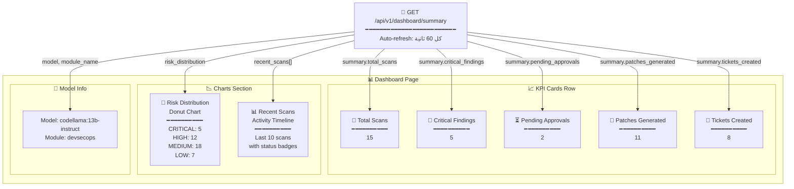

> [!TIP]
> الـ Dashboard يعتمد على **endpoint واحد فقط** (`GET /api/v1/dashboard/summary`) الذي يجمع كل البيانات المطلوبة.

---

## 📤 صفحة 2: Scan Center (مركز الفحص)

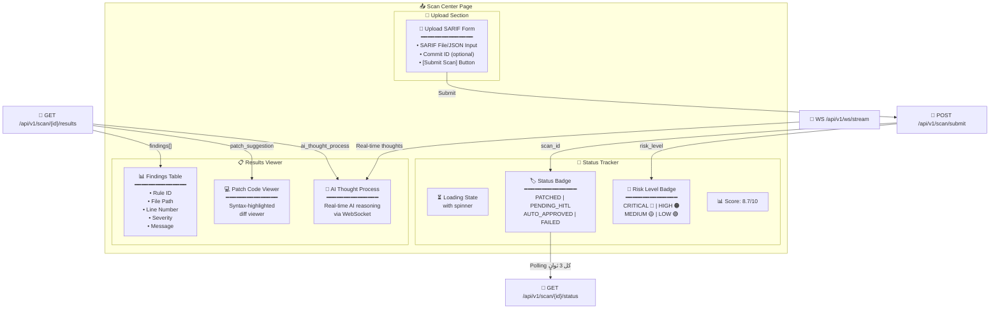

### تدفق المستخدم في صفحة الـ Scan:

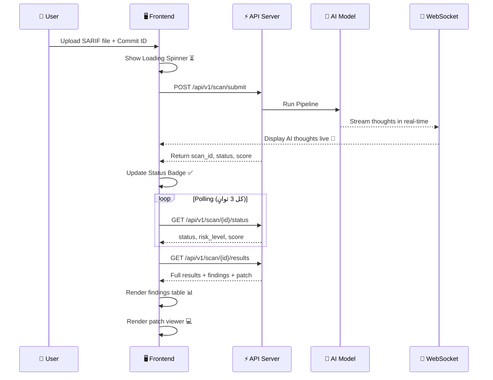

---

## 🔍 صفحة 3: Findings (الثغرات)

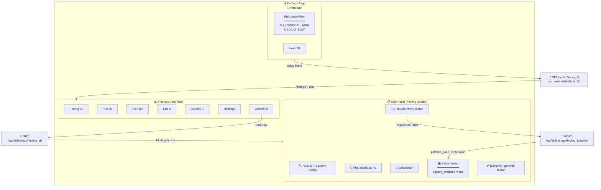

### تدفق طلب الـ Patch:

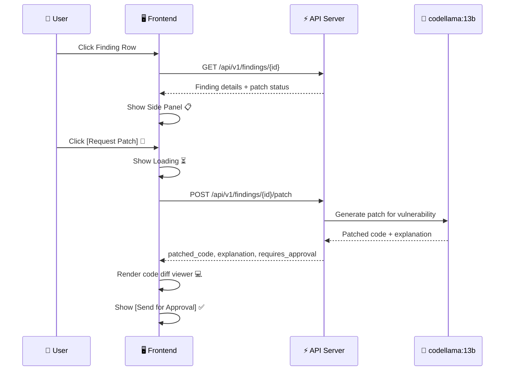

---

## ⏳ صفحة 4: HITL Approvals (الموافقات البشرية)

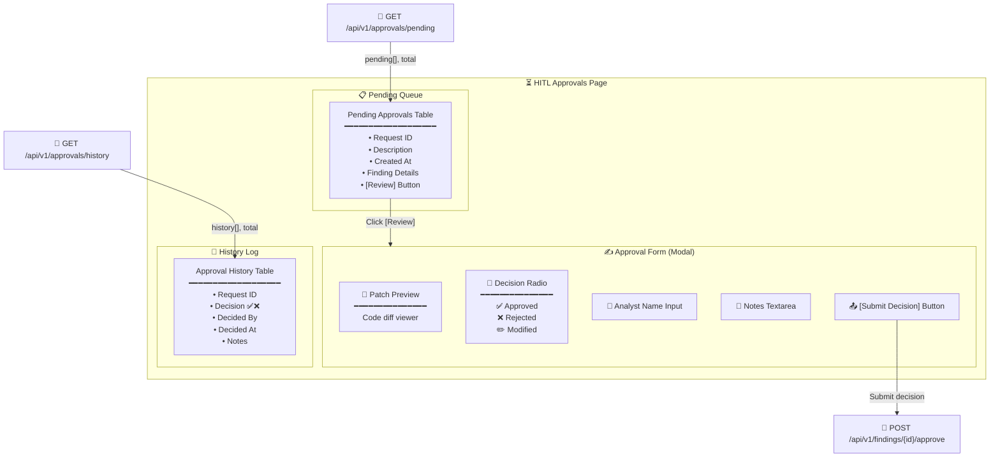

### تدفق عملية الموافقة:

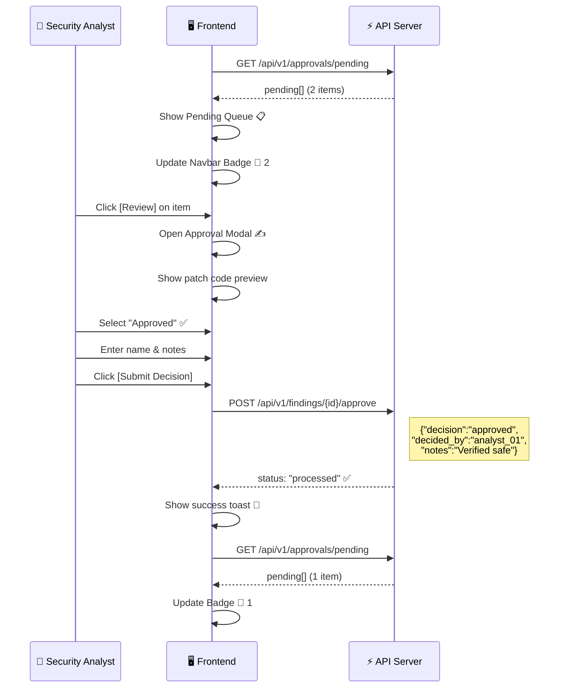

---

## 🚨 صفحة 5: SOC Alerts (تنبيهات SOC)

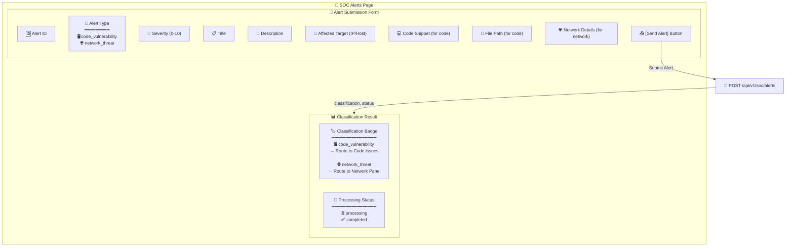

### تدفق تصنيف الـ SOC Alert:

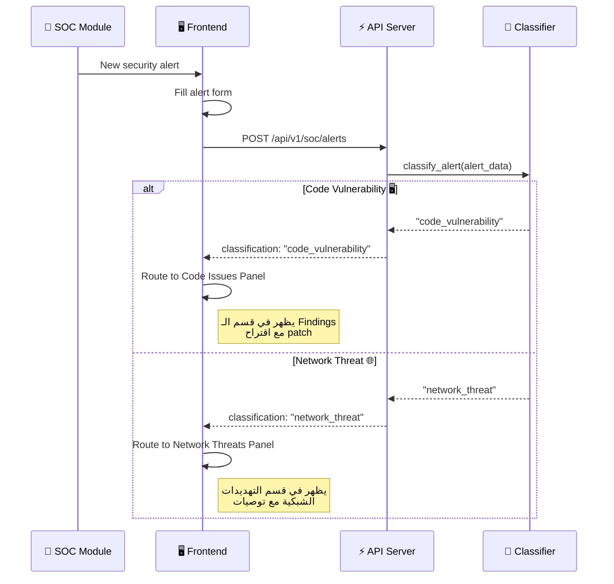

---

## 🎫 صفحة 6: Tickets (التذاكر)

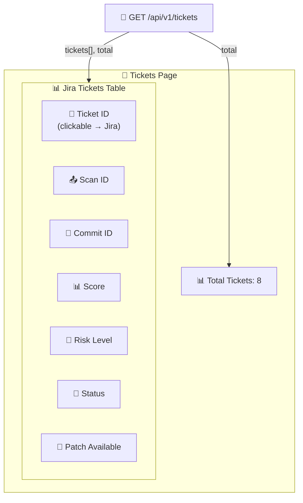

---

## 🔝 Navbar Component — Endpoints Mapping

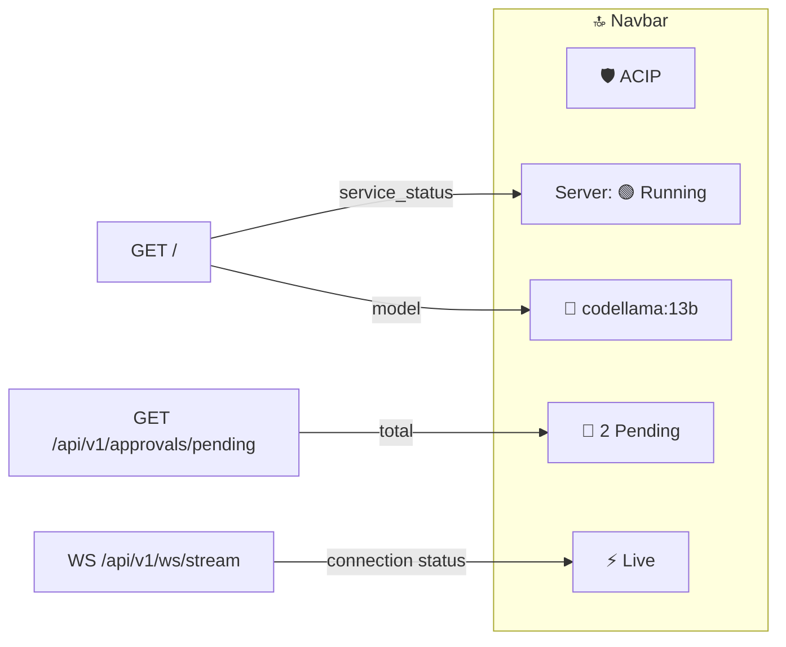

> [!IMPORTANT]
> الـ Navbar يستدعي `GET /` عند تحميل التطبيق، ويحدّث `GET /approvals/pending` كل **30 ثانية**، والـ WebSocket يبقى **دائم الاتصال**.

---

## 🔌 WebSocket Integration (البث المباشر)

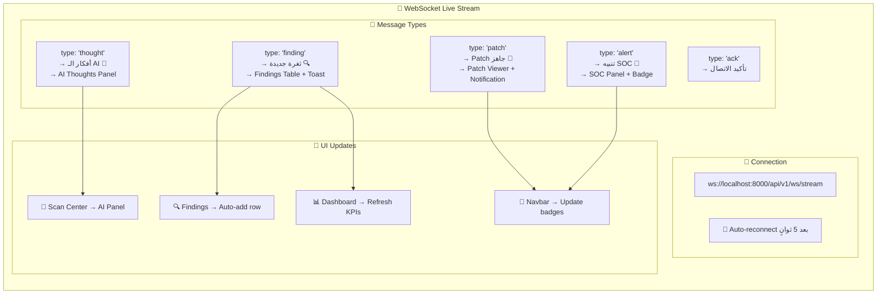

---

## 📋 ملخص ربط الـ Endpoints بالـ Frontend

| # | Endpoint | Method | الصفحة | المكون في الـ UI | طريقة الاستدعاء |
|---|----------|--------|--------|-----------------|----------------|
| 1 | `/` | `GET` | Navbar | Server Status Badge + Model Info | عند تحميل التطبيق |
| 2 | `/api/v1/scan/submit` | `POST` | Scan Center | Upload SARIF Form → Submit Button | عند رفع scan جديد |
| 3 | `/api/v1/scan/{id}/status` | `GET` | Scan Center | Status Badge + Risk Badge | Polling كل 3 ثوانٍ |
| 4 | `/api/v1/scan/{id}/results` | `GET` | Scan Center | Findings Table + Patch Viewer + AI Panel | بعد انتهاء الـ scan |
| 5 | `/api/v1/soc/alerts` | `POST` | SOC Alerts | Alert Form → Send Button | عند إرسال تنبيه SOC |
| 6 | `/api/v1/findings` | `GET` | Findings | Findings Data Table + Filter Bar | عند فتح الصفحة + تغيير الفلتر |
| 7 | `/api/v1/findings/{id}` | `GET` | Findings | Side Panel (Finding Details) | عند النقر على صف |
| 8 | `/api/v1/findings/{id}/patch` | `POST` | Findings | Patch Viewer في Side Panel | عند النقر على [Request Patch] |
| 9 | `/api/v1/approvals/pending` | `GET` | HITL + Navbar | Pending Queue Table + 🔔 Badge | كل 30 ثانية + عند فتح الصفحة |
| 10 | `/api/v1/findings/{id}/approve` | `POST` | HITL | Approval Form Modal → Submit | عند إرسال القرار |
| 11 | `/api/v1/approvals/history` | `GET` | HITL | History Log Table | عند فتح تبويب History |
| 12 | `/api/v1/tickets` | `GET` | Tickets | Tickets Data Table | عند فتح الصفحة |
| 13 | `/api/v1/dashboard/summary` | `GET` | Dashboard | KPI Cards + Charts + Recent Scans | كل 60 ثانية |
| 14 | `/api/v1/ws/stream` | `WS` | Global | AI Panel + Notifications + Badges | اتصال دائم |

---

## 🔀 خريطة التنقل بين الصفحات

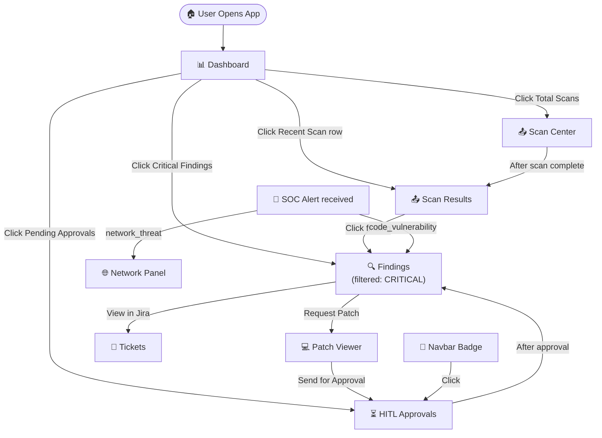

---

## 🏗️ هيكل المكونات (Component Tree)

```
🌐 App
├── 🔝 Navbar
│   ├── Logo                          ← Static
│   ├── ServerStatusBadge             ← GET /
│   ├── ModelInfoBadge                ← GET /
│   ├── PendingApprovalsBadge 🔔     ← GET /api/v1/approvals/pending
│   └── WebSocketIndicator ⚡         ← WS /api/v1/ws/stream
│
├── 📌 Sidebar
│   ├── NavLink → Dashboard
│   ├── NavLink → Scan Center
│   ├── NavLink → Findings
│   ├── NavLink → HITL Approvals
│   ├── NavLink → SOC Alerts
│   └── NavLink → Tickets
│
├── 📄 Pages
│   ├── 📊 DashboardPage
│   │   ├── KPICardsRow               ← GET /api/v1/dashboard/summary
│   │   ├── RiskDistributionChart     ← GET /api/v1/dashboard/summary
│   │   ├── RecentScansTable          ← GET /api/v1/dashboard/summary
│   │   └── ModelInfoCard             ← GET /api/v1/dashboard/summary
│   │
│   ├── 📤 ScanCenterPage
│   │   ├── SarifUploadForm           → POST /api/v1/scan/submit
│   │   ├── ScanStatusTracker         ← GET /api/v1/scan/{id}/status
│   │   ├── FindingsResultTable       ← GET /api/v1/scan/{id}/results
│   │   ├── PatchCodeViewer           ← GET /api/v1/scan/{id}/results
│   │   └── AIThoughtsPanel           ← WS /api/v1/ws/stream
│   │
│   ├── 🔍 FindingsPage
│   │   ├── RiskFilterBar             → GET /api/v1/findings?risk_level=X
│   │   ├── FindingsDataTable         ← GET /api/v1/findings
│   │   └── FindingDetailSidePanel
│   │       ├── FindingInfo           ← GET /api/v1/findings/{id}
│   │       ├── PatchViewer           ← POST /api/v1/findings/{id}/patch
│   │       └── ApprovalButton        → Navigate to HITL
│   │
│   ├── ⏳ HITLApprovalsPage
│   │   ├── PendingQueueTable         ← GET /api/v1/approvals/pending
│   │   ├── ApprovalFormModal         → POST /api/v1/findings/{id}/approve
│   │   └── HistoryLogTable           ← GET /api/v1/approvals/history
│   │
│   ├── 🚨 SOCAlertsPage
│   │   ├── AlertSubmissionForm       → POST /api/v1/soc/alerts
│   │   └── ClassificationResultPanel ← Response from POST
│   │
│   └── 🎫 TicketsPage
│       └── TicketsDataTable          ← GET /api/v1/tickets
│
└── 🔌 WebSocketProvider (Global)     ← WS /api/v1/ws/stream
    ├── → AIThoughtsPanel
    ├── → NotificationToasts
    └── → NavbarBadges
```

---

## 🔄 Data Flow Overview (التدفق الكامل)

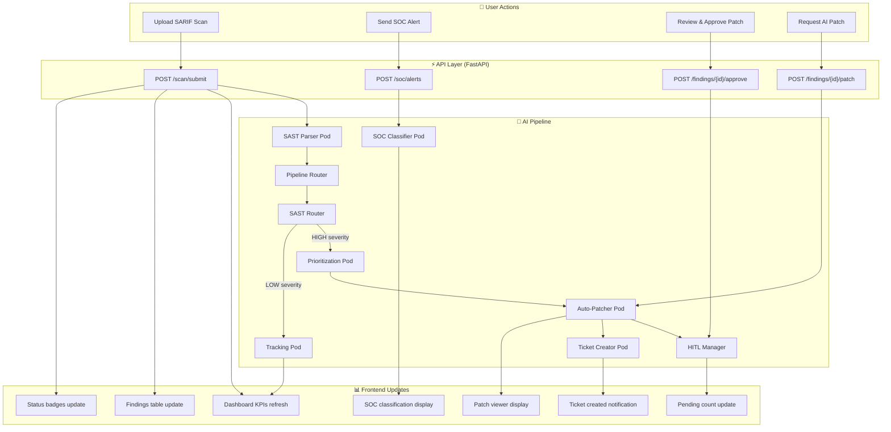
